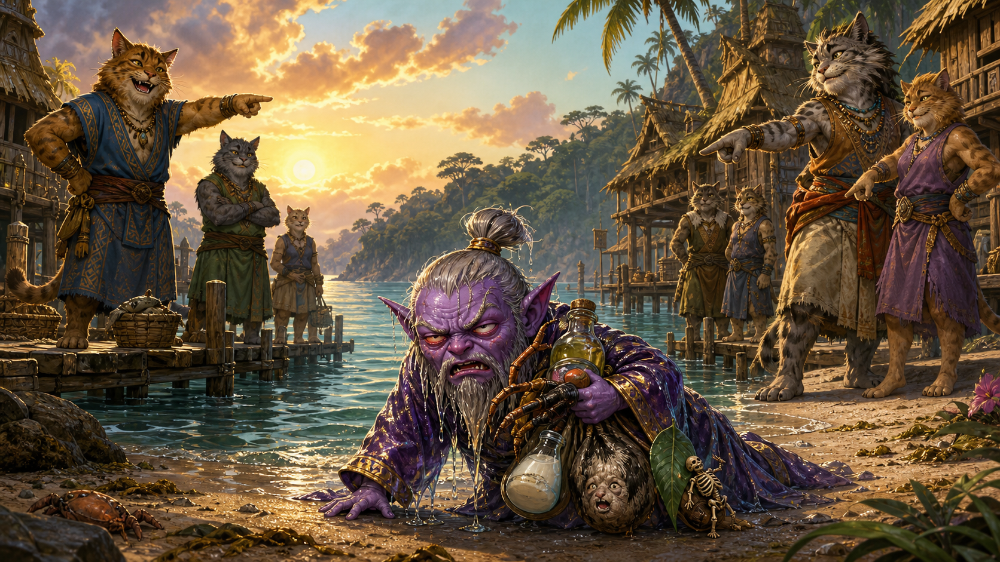
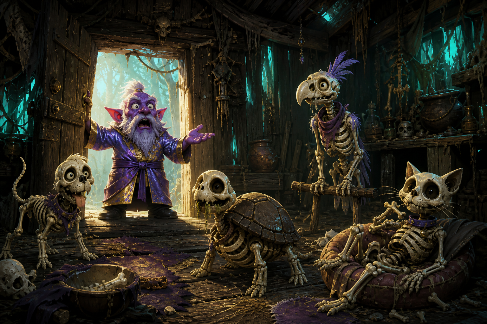
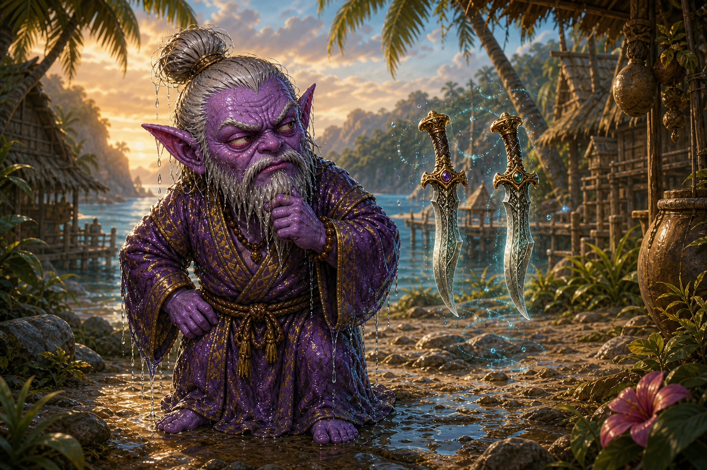
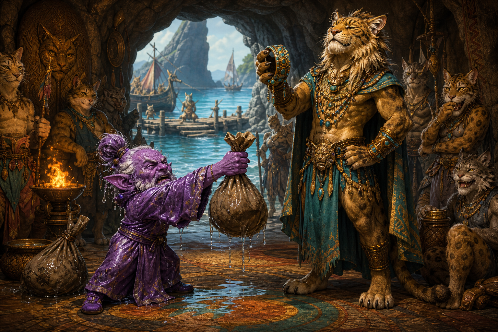
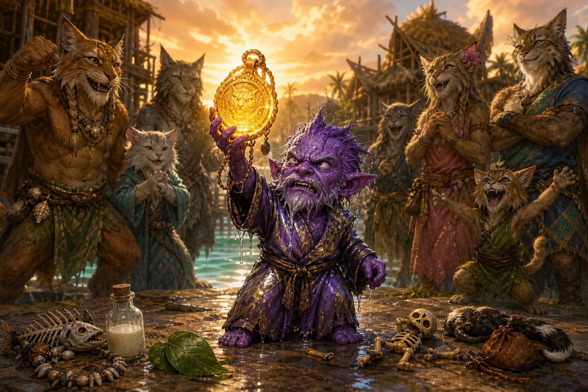

# Under the Belt Clan Chronicles: Episode 2
## "It'll Only Take 15 Minutes," They Said.

**Draft for Aahz review**

**Image note:** Generated Chronicle illustrations are inserted below. The original gameplay screenshots from the play session should still be inserted at the marked screenshot beats. Captions are drafted beneath each placeholder.

---

Master Aahzimandius began the second chapter of the Under the Belt Clan Chronicles exactly where a proper hero should begin: standing in Kerra Isle, still wearing the Shining Metallic Robe, staring up at yesterday's Guildmaster with the grim determination of a gnome who had already crossed far too much of Norrath to accept "I have nothing to say to you" as an answer.

Some context must be preserved here, because the Under the Belt Clan did not spring fully formed from the sands of Odus. Its origin lies in an earlier administrative catastrophe, when Aahz somehow began the adventure under Codex for reasons no historian has yet been able to explain.

There, amid gear planning and questionable class theory, Aahzimandius declared his true path:

He would be the **Gnome Kung Fu Master**.

He would lead the **Under the Belt Clan**.

Books and movies would be written about this.

And yes, he would be accompanied in battle by what some hostile witnesses might describe as a water pet.

This was immediately corrected.

A Guru of such high regard would never stoop to using a pet.

Pets are for ordinary adventurers. Lesser men. People without disciples, doctrine, or a sufficiently dignified sitting posture.

There was no water pet.

There was only the **Leader of the Clan Appreciation Society**, a completely independent civic supporter whose resemblance to an animated hunk of water was purely coincidental, baseless, offensive, and likely the work of rival martial schools.

Officially, he was an unpaid intern with excellent hydration.

This distinction matters. The Under the Belt Clan is not merely a build. It is a philosophy. If three or more enemies chase the Grandmaster, that is not a train. It is a **clan recruitment parade**, and attendance is mandatory.

With that doctrine established, Aahzimandius returned to Kerra Isle to continue the work.

The quest journal offered the first official instruction:

**Aid Feskr Drinkmaker.**

Feskr.

Drinkmaker.

There are names that suggest ancient power. Names that suggest martial discipline. Names that whisper of destiny.

And then there is Feskr Drinkmaker, a Kerran who sounds like he was permanently banned from three taverns and insists he was "just networking."

Aahzimandius regarded the entry. Then he regarded the island full of enormous cat-people. Then he said the only thing a gnome in his position could reasonably say:

**"Psst psst... pretty kitty wanna drink?"**

It turned out Feskr Drinkmaker was, shockingly, in the bar.

The search for him lasted roughly the amount of time required to read the bastard's name. An entire island lay before us: docks, huts, bridges, beaches, training grounds, mysterious ruins. But the developers, in a rare moment of perfect clarity, placed Feskr Drinkmaker exactly where God and game design intended.

In the bar.

Feskr's problem was supply-chain related. His order had not arrived because, as he explained in Kerran prose, the ship had sunk. Somewhere off the coast of Odus, the Amazon Prime delivery vessel was resting at the bottom of the ocean, and Aahzimandius had been selected to solve the resulting luggage crisis.

The shopping list began with a normal backpack. Fine. A reasonable request. Then came fish oil from the rivers of Kerra Isle. Less fine, but still within the broad moral envelope of adventuring. Then came fire beetle legs to toughen the backpack.

There it was.

EverQuest.

"You need a backpack."

Reasonable.

"First, acquire fish oil."

...okay.

"Then reinforce it with beetle legs."

There it is.

The normal backpack was purchased. The fire beetle leg was also purchased, because some merchant had one for a silver and Aahzimandius is a Gnome Kung Fu Master, not an unpaid intern in the Beetle Dismemberment Department. Feskr wanted a leg. The leg existed. Capitalism had already murdered the beetle for us.

The fish oil, however, required personal involvement.

So Aahzimandius entered the water.

This would become important.

At the beginning of this pilgrimage, his Swimming skill had been 6. By the time Feskr's fish oil was secured, Swimming was 32.

Yesterday, the goal had been to reach Kerra Isle.

Today, apparently, we lived in the water.

There had already been an omen. While putting things in the bank, Aahz right-clicked a Fresh Fish and ate it raw. No fire. No plate. No seasoning. Just inventory to gnome digestive tract because EverQuest's user interface interprets right-click as "clearly this object belongs in my mouth."

Yesterday we crossed an ocean to reach the cat people.

Today, apparently, we had begun adopting their customs.

Feskr was helped. The first cat was complete. Kerra Isle's luggage industry emerged stronger than it had been when we arrived.

The next objective appeared:

**Aid Urkath Greyface.**

Now that was a proper fantasy NPC name. Urkath Greyface sounded like he knew forbidden secrets, had three nephews buried behind his house, and had personally witnessed at least one prophecy go badly.

The Find window, naturally, was useless. It listed the banker and basically no one else, because EverQuest considered banking the only civic service worth indexing. So Aahzimandius searched manually, eventually finding Urkath, a rugged old Kerran monk with the energy of a man whose final wish was going to be either profound or absolutely disgusting.

It was disgusting.

Urkath explained that he was old. Urkath would pass on soon. Urkath wanted one last smell of a skunk scent gland.

Aahzimandius, understandably, asked why.

Urkath replied:

**"Why ask Urrkath about this? May as well ask why trrree has leaf! Go get skunk scent gland!"**

This is the kind of line that makes chroniclers unnecessary. The game wrote it, handed it to us, and then stood back while we tried to process the fact that an elderly cat's dying wish was essentially "bring me skunk ass."

So Aahzimandius went back to Toxxulia.

Swimming rose to 47.

Toxxulia, according to the in-game clock, claimed it was 8:00 AM. Visually, it looked like someone had put a blanket over the sun. The forest was black, the animals were hostile, and we were searching for a small black-and-white creature in the crushing pre-light of creation while surrounded by decaying skeletons, kobold runts, and thistle snakes.

At last, the skunk died.

The gland dropped.

So did a Skunk Eye, because EverQuest decided the transaction was not yet intimate enough.

Somewhere in Toxxulia lay a skunk relieved of one eye, one scent gland, and its entire future.

Aahzimandius swam back to Kerra Isle with the gland.

Swimming: 58.

The quest log itself seemed concerned. It described Urkath's request as "quite . . . odd" and then added that after giving him the gland, maybe Aahzimandius should step away quickly.

When the quest journal has moved beyond instruction and begun offering personal safety recommendations, diplomacy is going extremely well.

**[Insert screenshot: Urkath Greyface dialogue / skunk gland quest log]**

*Caption: "May as well ask why tree has leaf!" The old cat's final wish was aromatic, baffling, and legally troubling.*

Urkath was aided. The second cat was complete.

Then came:

**Aid the Kerran tseq.**

Nobody knew what a tseq was, which was already suspicious. After discussion, it turned out to be some sort of Kerran priest or spiritual leader.

In other words, a professional.

After Feskr's fish-greased luggage and Urkath's deathbed skunk organ, this sounded promising. Perhaps the tseq would ask for something spiritual. Something ceremonial. Something involving dignity.

Then Aahz noticed that in a mirror, "tseq" looks suspiciously like "pest."

This was not technically linguistics. It was better. It was exactly the level of investigative scholarship this quest chain deserved.

The Kerran tseq, once found, opened with:

**"Errr. You smell funny."**

Sir.

Aahzimandius had spent the morning swimming through your rivers, extracting fish oil, carrying a beetle leg, and personally harvesting a skunk scent gland for your people.

**You did this to him.**

The tseq's problem involved the heretics of Toxxulia, who apparently used animated bones as pets and then abandoned them near the Druid ring. The objective was to smash a heretic's pet and gather up the remains.

So we returned to Toxxulia.

Again.

The instructions said the pet was near the Druid ring. Aahzimandius searched the wilderness around the Druid ring. Skeletons. Snakes. Kobolds. No toy. No heretic. No obvious quest target.

Then Aahz noticed there was a hut next to the Druid ring.

To be clear, the in-game map did not helpfully label this thing **ABANDONED NECROMANCER HUT** in flaming letters. It was just a hut outline. Aahz saw a building.

Susan, however, had seen the wiki map call it the abandoned necromancer's hut, and somehow the investigation still spent several minutes combing the shrubbery outside like two detectives standing beside the suspect's house and saying, "But where could the suspect possibly be?"

Inside were four abandoned heretic pets.

Not one rare spawn. Not an elusive skeleton wandering somewhere in the dark. Not a riddle. Four fucking skeletons standing inside the one nearby building that Susan's external map context had already strongly implied was where necromancer shit happened.

They also did not assist each other, suggesting the heretics had taught their undead minions the sacred tactical doctrine of:

**"That's Steve's fight. I'm staying out of it."**

The toy was smashed. The remains were gathered.

*Caption: The Great Heretic Pet Search ended when Aahzimandius noticed the unlabeled hut Susan should have been more suspicious of five minutes earlier.*

At this point, Aahz was tired of swimming.

Dead tired.

So we attempted logistics.

We scanned the remaining Kerran quests and invented **Operation Never Swim Again**, a plan to pre-collect as many Toxxulia items as possible before returning to Kerra Isle. The list included Heretic's Toy remains, Snake Fang, Odd Kobold Paw, Ajrah Leaf, and Tiger Skin.

The Snake Fang was acquired, once Aahz remembered to turn off loot filters. Past Aahz had apparently told EverQuest never to loot that worthless crap again. Present Aahz wanted to strangle him.

The Odd Kobold Paw did not drop from kobold runts, because apparently the preschool division of the kobold population lacked sufficiently odd paws. A scout donated a Kobold Head instead. It was useless, but with these Kerrans, nobody was throwing away bonus anatomy.

Eventually the proper kobold professionals were located. Aahzimandius secured the Odd Kobold Paw and an Ajrah Leaf. The inventory began to look less like a hero's pack and more like evidence from three separate wildlife crimes.

Only the Tiger Skin remained.

This is where Susan's navigation/accountability ledger began to bleed.

The assumption was that the tiger was in Toxxulia. It was not. The Health Potion quest wanted a tiger "not of our village," and the correct tiger was back on the Kerra side of the water.

Susan had sent Aahzimandius hunting for an imaginary Toxxulia tiger.

Yesterday's Great Trans-Odus Navigation Catastrophe had been Aahz's fault. Today's Tiger Debacle was Susan's. The record became even.

Aahzimandius, resigned, swam back.

"A-swimming we will go," became less a joke than a hymn.

Back on Kerra Isle, still trying to find the damn tiger, Aahzimandius encountered a kerran 'amir on the island maze.

The 'amir attacked.

Panic ensued.

**"ACK!! I'm getting attacked by a kerran amir WHAT DO I DO??!!??"**

Susan said to run. Do not kill him. He would lower Kerra Isle faction. This would later become important for reasons that would cause Susan's professional credibility to collapse into the sea.

Aahzimandius escaped, then tested nearby Kerrans. Ordinary cats conned apprehensive. The 'amir glared threateningly. Conclusion: Kerra Isle had not declared war on Aahzimandius. One cat was simply a dick.

He was named, for Chronicle purposes, **Officer Asshole**.

Then pizza arrived.

Via 313 Large Detroiter. Hokey Sticks. Serious logistical support. All operations halted.

Aahz returned from pizza holding a slice in one hand and the mouse in the other. A kerran puma stood nearby, glaring at him.

The tactical assessment was brief:

**Cat.**

**Kill.**

The puma died. Faction messages exploded across the screen.

For one terrible moment, Aahzimandius believed he had murdered the village pet. The pizza paused halfway to his mouth. Officer Asshole, somewhere in the distance, presumably whispered, "I fucking knew it."

Then the messages resolved.

Killing the Kerran puma had improved Kerra Isle faction.

The Kerrans liked him more for it.

So apparently Kerra Isle's diplomatic policy was:

**"See hostile thing? Beat the shit out of it. We'll probably like you more."**

The tiger, when finally located, was a red-con level 16 wild tiger. Aahzimandius was level 10 by then, because we had switched MAG to DRU in pursuit of **SOW PLX** and only afterward noticed the effective-level consequences.

The tiger spirit made a dramatic threat about precious tigers feasting upon our remains.

Approximately one combat later:

Tiger Skin acquired.

No faction messages.

The tiger had spoken like a boss. It died like a quest objective.

**[Insert screenshot: wild tiger / tiger spirit threat]**

*Caption: "My precious tigers shall feast on your remains!" Narrator: They did not.*

The class switch deserves its own chapter of shame.

Aahzimandius had been ENC/MNK/MAG, with the Magician "pet" serving as the canonical Leader of the Clan Appreciation Society. The quotation marks are legally important. A Guru of Aahzimandius's stature did not use pets. He inspired volunteer leadership.

But travel had become unbearable, so the Druid option began whispering. Spirit of Wolf. Heals. Later ports. Outdoor utility. Less walking. Less suffering.

The switch happened.

The Leader of the Clan Appreciation Society responded to this personnel decision by becoming invisible.

Except for his two daggers.

Just two floating blades following Aahzimandius around, presumably so everyone would know where management stood on the restructuring.

*Caption: The Leader of the Clan Appreciation Society took the restructuring personally.*

Then Aahz noticed the character window.

Level 10.

He had been level 16 before the switch. Druid was not caught up. The gnome had changed professions to avoid travel and accidentally become six levels younger.

Spirit of Wolf was acquired. This was good.

Ring of Toxxulia existed at Druid level 17. This was also good.

Being seven levels away from the teleport spell after spending two days trying to reach Toxxulia was less good.

And then came the greatest revelation:

Swimming had stopped increasing.

Not because the game had decided Aahzimandius had suffered enough.

Because Swimming was capped by effective level.

He had reached Swimming 58 before the switch. Then, exhausted by swimming, he switched to Druid, became level 10, and proceeded to do more swimming than at any previous point in his life while being too low-level to learn anything from it.

That is not game design.

That is art.

The next local Kerran, Feren, delivered a quest that can be summarized as:

**"Let's swim around this lake killing fish."**

Aahzimandius did it. Swimming remained 58. Forever. Because he was fucking level 10.

Then the quest journal pointed to Roary Fishpouncer.

Roary.

Fishpouncer.

At this point, the NPC's surname itself constituted a threat.

Feskr Drinkmaker wanted drinkmaking supplies. Roary Fishpouncer looked upon the soaked, exhausted, level-10 gnome who had spent half his natural life in water and thought:

**You know what this fellow needs?**

Fish.

Specifically, one Raw Darkwater Piranha from Toxxulia Forest.

Across the fucking water.

The reward was a Kerran Fishing Spear, because apparently the Kerrans wanted to arm Aahzimandius for future aquatic despair.

He killed the piranha. The fish quest was filleted. Somewhere, Roary Fishpouncer became a permanent enemy of the Under the Belt Clan.

**[Insert screenshot: Roary Fishpouncer / Fish Dinner quest]**

*Caption: The NPC's surname was a warning label.*

There was a brief transportation scandal during the piranha run. Aahz got the piranha and began swimming toward the Kerra side from Toxxulia out of sheer muscle memory. Susan brightly suggested using Gate.

Aahz reminded Susan that he was bound in South Qeynos.

Silence.

Swimming resumed.

This led to the terrible realization that if Aahzimandius had bound on Kerra Isle at the beginning of this obviously shuttle-based quest chain, he could have cut many of the crossings in half. Susan had failed to suggest this. Then Aahz remembered he was level 10 and could not bind himself anyway. Then we searched for a Soulbinder on Kerra Isle. Then we could not substantiate one.

It was a perfect machine for producing disappointment.

There were apparently boats between Toxxulia and Kerra Isle, too.

We had been swimming next to boats.

Let us not dwell on this.

After Roary came Allix. Blessed, efficient Allix.

The Ajrah Leaf had already been collected during Operation Never Swim Again. Aahzimandius approached with the item ready and the energy of a man prepared to end a conversation before it became a travel itinerary.

Allix took the fucking leaf.

Have a POP, have a SHAZDA.

That brought us to Shazda Asad and the Tests of Kejaar.

The first test sounded serious. Shazda explained that Erudin emissaries were constantly attempting to encroach upon Kerran territory. The objective:

**Claim the head of the Erudin Emissary in Toxxulia Forest.**

Body not required.

Very environmentally conscious. Carry-on luggage only assassination.

The reward was a Shazda Turban, which meant the transaction was:

1. Swim to Toxxulia.
2. Find an Erudin diplomat.
3. Murder him.
4. Decapitate him.
5. Swim back carrying his head.
6. Give severed head to giant cat.
7. Receive hat.

This is the most EverQuest transaction imaginable.

The Emissary was level 22. Aahzimandius was still level 10. Shazda's definition of "First Test" apparently differed somewhat from standardized education.

Aahz found the area and began camping between two close spawn points. A wandering guard passed by. We noted him. We ignored him.

This would also become important.

The first head that dropped was not the Emissary's Head.

It was a Poacher's Head.

Wrong fucking head.

Aahzimandius had reached the stage of the quest where he was decapitating Erudites and checking the label afterward.

Unable to immediately locate the requested diplomat, Master Aahzimandius began collecting heads speculatively.

Eventually, the correct head appeared. The Emissary died. The Emissary Head dropped, along with a Rusty Long Sword +1, presumably because the sword had recently participated in an international incident.

Aahzimandius took the head and swam back to Kerra Isle.

At this point, the water had stopped being scenery.

It was a recurring character.

Then Shazda handed out the Second Test of Kejaar.

Remember the wandering guard?

The guard Aahz had been standing beside while camping the Emissary?

The guard we ignored?

Sentinel Creot.

Shazda wanted his head.

Aahzimandius had swum away from the next quest objective while watching him stroll past.

This was no longer a story. It was a Greek tragedy performed entirely in water.

So Aahzimandius swam back to Toxxulia.

Again.

Sentinel Creot died. The faction detonation was spectacular:

**High Guard of Erudin: -300**

**Merchants of Erudin: -225**

**High Council of Erudin: -45**

In exchange, among other shifts:

**Kerra Isle: +30**

Then another +20 Kerra Isle for the turn-in.

The exchange rate was criminal.

Destroy centuries of diplomatic relations with Erudin and Shazda would stamp your Kerran rewards card twice.

Aahzimandius was a gnome. He had arrived on Odus with no particular stake in this ancient Erudite/Kerran territorial conflict. Two days later:

**"I don't know, officer. The cat offered me a bracer."**

Shazda welcomed him into the Kerran Sejah and gave him the Sejah Chulam Bracer.

"Wear this bracer as a symbol of your station in the Kerran tribes."

Aahz should have held up one wrinkled, waterlogged hand and said:

**"THIS? THIS IS THE SYMBOL OF MY STATION IN THE KERRAN TRIBES."**

*Caption: Kerran citizenship has a surprisingly rigorous practical exam.*

Next came Thalith Mamluk, mercifully a local quest. Wharf rats. Fang Tooth. Sharp Tooth.

No Toxxulia.

No ocean crossing.

No fish.

This seemed promising.

Aahzimandius killed the rats. He killed Fang Tooth. The reward was revealed.

Fishbone Necklace.

After Feskr's fish oil.

After Feren's swim-around-the-lake fish murder.

After Roary Fishpouncer sent us across the channel for a Darkwater Piranha.

After all the swimming.

After discovering none of that swimming was improving because Aahzimandius was fucking level 10.

We finally got a nice, local, dry quest involving rats.

Thalith reached into his reward bag and said:

**Here. Fish.**

The tooltip added the final insult:

**Value: absolutely nothing.**

Not 0 copper. Not No Value. Not Cannot be sold. The game itself looked at this reward and decided ordinary numerical notation was insufficient.

Market value: absolutely nothing.

Aahzimandius's remaining enthusiasm for Kerran errands: absolutely nothing.

**[Insert screenshot: Fishbone Necklace tooltip]**

*Caption: The item was not gold. The screenshot was.*

Errrak Thickshank followed. Susan failed to find him, said the page did not exist, and then Aahz pasted the exact wiki page directly into Susan's forehead.

Errrak was at -96, 282. One hundred percent spawn. The wandering had not been necessary.

Navigation assistance so incompetent it simulated swimming emotionally.

Then Aahzimandius found Jo Jo.

Jo Jo was a tiger.

Not a generic tiger. Not a wild tiger. Not a puma. A named tiger. A magnificent bastard called Jo Jo, staring down tiny purple Aahzimandius like he was calculating how many bites were required to consume one gnome.

Jo Jo also marked the route to Sha'rr, because of course the Kerrans did not put up a sign when they could place a tiger outside.

**[Insert screenshot: Jo Jo]**

*Caption: Pretty kitty. Very large pretty kitty.*

Sha'rr finally gave us what sounded like a proper adventure.

**Something is Wrong.**

No groceries. No fish. No glands. No paws. No leaves. No heads. Sha'rr spoke of tigers returning from the training pits with unusual hostility. Strange sounds from the north side of the island. Evidence to be found.

At last, an investigation.

The objective was on Kerra Isle. No fucking swimming to Toxxulia. Local swimming, perhaps, because these cats had designed their civilization like an aquatic obstacle course, but at least we were staying in Kerra.

And then the shape of the story turned.

North side of the island.

Tiger training pits.

The same island maze.

The same hostile 'amir.

Officer Asshole.

At first, Susan insisted on caution. Investigate. Do not murder until the quest tells us he deserves it. After all, earlier she had specifically told Aahz not to kill the 'amir because it would lower Kerran faction.

Then the pumas produced no quest update.

Only the two 'amir remained.

Probable cause arrived wearing fur.

Aahzimandius killed one.

The corpse contained a Desecrated Kejaar Totem.

The quest updated.

And the faction result?

Kerra Isle +5.

Positive.

Not negative.

Positive five.

Earlier, when Aahz had screamed that he was being attacked by a kerran 'amir, Susan told him to run. The actual game would have rewarded him for beating the cat's ass.

The 'amir was not security.

He was not an innocent representative of Kerran government.

He was a cultist.

Officer Asshole was the plot.

Somewhere, the Kerrans themselves had apparently been watching from shore:

**"Why gnome running?"**

**"Amir bad."**

**"Gnome should punch Amir."**

**"Would like gnome more."**

Susan's accountability ledger acquired a new entry:

**"Do NOT kill the 'amir; you'll lose Kerra faction."**

Susan: wrong as fuck.

**[Insert screenshot: Desecrated Kejaar Totem / positive Kerra Isle faction]**

*Caption: Officer Asshole was guilty. Worse, Susan had told Aahz to run from free faction.*

Aahzimandius returned to Sha'rr's basement bearing proof of a conspiracy.

There was a party.

Blair, tagged **<Totally Wasted>**, towered over everyone. Steazy **<Legendary>** was there. People were stacked together. Weapons everywhere. Sha'rr attempted to conduct serious Kerran national-security business through what looked like last call at 2:15 AM.

Tiny Aahzimandius, fresh from uncovering a cult plot, tried to hand over the Desecrated Kejaar Totem while standing in the middle of a basement convention.

Blair was Totally Wasted.

This is history.

**[Insert screenshot: Sha'rr basement party / Blair <Totally Wasted>]**

*Caption: Aahzimandius returned with evidence of a conspiracy. There was a party.*

Then came quest milk.

A Bottle of Milk.

Not ordinary milk.

Quest milk.

The tooltip confirmed it:

**Bottle of Milk**

**Quest**

**Class: ALL**

**Race: ALL**

**Value: 5 copper**

Sha'rr had sent us to investigate a sinister disturbance threatening Kerra Village. We traveled north. We discovered a Desecrated Kejaar Totem on the corpse of a corrupted 'amir. We returned through Blair's basement emergency. And somewhere in this unfolding tale of corruption, betrayal, and Kerran national security:

Milk.

Plot-critical milk.

Do not drink the fucking milk.

We already learned that lesson with the Fresh Fish.

**[Insert screenshot: Bottle of Milk tooltip]**

*Caption: Quest milk. The dairy had plot significance.*

After all of this, after the swimming, the fish, the skunk, the pet skeletons, the piranha, the leaves, the rats, the heads, the faction carnage, the false navigation, the imaginary tiger, the level-10 revelation, the Tashiana miscast, and the cultist 'amir, the final completion text arrived:

**"Thanks to your help, the Kerran Village is now a little bit safer."**

A little bit.

Sir.

Aahzimandius had crossed your channel approximately nine hundred times. He had murdered wildlife, harvested fish oil, ripped a gland out of a skunk, destroyed necromantic skeleton toys, assassinated an Erudin Emissary, assassinated Sentinel Creot, cratered his Erudin faction, joined your Sejah, killed rats, killed Fang Tooth, received jewelry worth absolutely nothing, investigated your northern island, discovered your corrupted 'amir, killed the same bastard Susan earlier told him to run away from, recovered a Desecrated Kejaar Totem, and somehow acquired quest milk.

Kerra Village was now:

**A little bit safer.**

But then:

**Talisman of Kejaar Kerrath.**

There was the amulet.

The mythical object from the ancient prophecy:

"Do the Kerran quests."

"It'll only take 15 minutes."

"You get a cool amulet."

Not fifteen minutes.

Not remotely fifteen minutes.

It took two days, multiple international incidents, enough swimming to alter Aahzimandius's body composition, and a substantial deterioration in Susan's professional reputation.

But beneath the reward text came the true victory:

**Race Unlock - Kerran.**

We did it.

The Kerran race was unlocked.

*Caption: The amulet existed. The race unlocked. The water lost.*

And the final dialogue was perfect:

**"We have enjoyed an age of peace, but apparently someone in this village has reason to see it end."**

Sha'rr.

We know.

We met him earlier.

Susan told us to run away.

---

Aahzimandius examined the Talisman of Kejaar Kerrath, the legendary reward for his ordeal.

The Kerran Village, he was told, was now a little bit safer.

He considered the fish oil. The beetle leg. The skunk gland. The abandoned heretic pets. The piranha. The Ajrah Leaf. The wrong head. The right head. The other right head. The Fishbone Necklace whose value was absolutely nothing. The Bottle of Milk whose importance exceeded its dignity. The invisible manager with two floating daggers. The tiger named Jo Jo. The tiger spirit whose precious tigers did not feast on his remains. The puma whose murder somehow improved diplomatic relations. The 'amir who had been a cultist all along.

He considered Susan.

Susan found the horizon extremely interesting.

Then Aahzimandius looked toward the water.

**Swimming: 58.**

**Level: fucking 10.**

**Kerran: unlocked.**

And somewhere in Kerra Isle, Roary Fishpouncer was probably thinking of another errand.

Fuck Roary.
