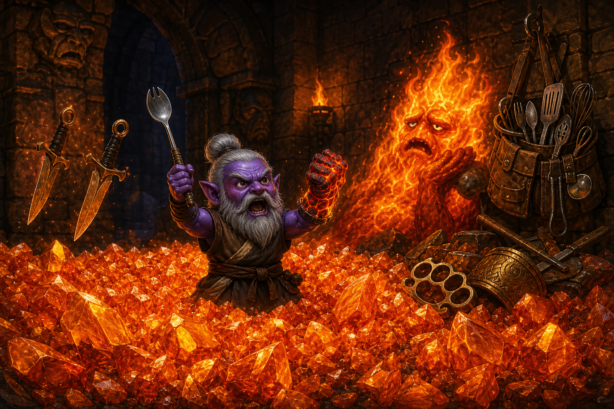

# UNDER THE BELT CLAN CHRONICLES

## Episode 7: The First Is A Lie

Episode 7 began as a technical experiment.

This is how all dangerous things begin.

Aahzimandius had ended Episode 6 at level 20. Alteration was specialized. Feign Death had been dragged from ceremonial neglect into actual Monk competence. Lower Guk had been physically found and politely declined. Quick Buff was funded.

The obvious next question was whether Susan could parse the raw EverQuest log if Aahz dragged it into chat.

This mattered because the Under the Belt Clan had outgrown oral tradition. Five episodes of "I swear the skeleton kicked me" had become a full industrial process. Najena was no longer a dungeon. Najena was a machine with receipts.

The proposed workflow was primitive and therefore correct:

Play.

Drag the current log onto Susan.

Say, "Susan, catch up."

Susan reads the black box, finds the checkpoint, and reconstructs the crimes.

The Factory Must Grow.

The Gnome Must Ding.

The Log Must Be Parsed.

> [SCREENSHOT NEEDED: images/screenshot-final-session-log-upload.png]
>
> Chat pull cue: Final file upload near the end of the chat where Susan says the log starts at 19:40, contains the buff setup, Najena entry, Chaos Camp, and 19,058 lines.
>
> Caption: The black box was recovered from the scene.

### SPORK Has Spoken

Before the machinery could start, Aahz announced dinner.

KFC.

Susan guessed badly.

Kentucky Fried Kyle.

Chicken bones.

Possible necromancy.

Wrong.

Aahz corrected the historical record:

SPORK.

Not spoon. Not fork. SPORK.

The official utensil of `<Under the Belt>`.

A hybrid solution to a problem nobody needed solved, somehow superior through sheer audacity. The MNK / DRU / ENC of eating implements.

Episode 7 had acquired a sponsor.

SPORK: When specialization is for people who only get one class.

And with that sacred utensil standing by, Aahz prepared to push The Button.

Quick Buff.

The one big stupid button.

The button had one job.

It failed.

Three seconds after activation:

Quick Buff interrupted.

Ability failed.

Timer reset.

Incident #001:

Cause: Button.

Corrective action: push the bastard again.

GFG: Get Fucked, GUI.

Then Aahz pushed it again.

At 19:53:11, the button worked.

Spirit of Wolf.

Cloud.

Breeze.

Strength of Earth.

Intellectual Superiority.

Skin like Rock.

Feral Spirit.

Shield of Barbs.

The entire Buff Set detonated in one glorious administrative explosion, and the skill window started ringing like a cash register.

Specialize Alteration went from 76 to 83.

Abjuration went from 18 to 22.

Quick Buff was not merely applying spells.

Quick Buff was a training program.

ONE BUTTON. WHOLE FACTORY.

> [SCREENSHOT NEEDED: images/screenshot-quick-buff-success-alteration-83.png]
>
> Chat pull cue: First uploaded log after "shit, the button failed us!!" and "My Skin Like Rock over writes Kyle's Courage"; Susan identifies Quick Buff succeeding at 19:53:11 and Specialize Alteration rising 76 to 83.
>
> Caption: Five episodes of manual buff suffering met one batch operation.

There was, naturally, legal contamination.

The log called Kyle "Venaner."

The log also wrote:

`Your pet's Courage spell has worn off.`

Daybreak's logging subsystem has no understanding of modern independent-contractor relationships.

Aahz then noticed the practical mechanic:

Skin like Rock overwrote Kyle's Courage.

Not a natural expiration.

Not mysterious Kyle morale collapse.

Quick Buff hit both Aahz and Kyle, Skin like Rock landed, and Kyle's self-cast Courage got shoved out of the benefits department.

Kyle was absolutely not a pet.

Kyle was, however, apparently eligible for the benefits package.

### The Veto Flag

Susan's first strategic vote was Lower Guk.

This was not insane.

Aahz had physically found Lower Guk yesterday. He was level 20. Feign Death was no longer at 1. Alteration was specialized. Quick Buff worked. The Guru could go inspect new content and maybe not become upholstery.

Then Aahz asked where he was going.

Susan revised to Upper Guk, because dead-side Lower Guk was probably still a little too tombstone-forward. Upper Guk near the Lower Guk dead-side zoneline looked like a level-20 exploration candidate.

Aahz pulled out the Veto Flag.

He was going to Najena.

Because the Guru could not leave Najena without a robe.

This was not a request.

This was fashion doctrine.

We were not going back merely for XP.

We were not going back merely for AA.

We were not even going back merely to test the level-20 Factory.

We were going back for the fucking robe.

Also the haste belt.

Also Flaming Fist.

Also anything else foolish enough to spawn inside the operational radius of the Gnome.

SPORK had spoken.

> [SCREENSHOT NEEDED: images/screenshot-najena-instance-5983-entry.png]
>
> Chat pull cue: Uploaded log after "CHAOS CAMP!!!!"; Susan says Aahz made it through Nektulos and Lavastorm, created Najena instance 5983, and entered at 20:05:22.
>
> Caption: Najena reopened under new utensil management.

There was one detour before the dungeon.

Aahz established a rule for Guk:

He did not want to kill live frogs.

Dead-side mobs? Fair game.

Non-faction targets? Fair game.

Living frogloks that damage useful faction? Hands off unless the loot is so compelling that Susan stops and explicitly asks whether it is worth the faction hit.

The Guru respects the living frogs.

The undead frogs have chosen violence by continuing to exist.

Standing rule logged.

Then Najena.

### Chaos Camp Opens

Najena greeted Aahz like an OSHA complaint with a door.

The entrance skeletons paid about 0.914% XP each at level 20. At 20:07, Aahz switched from ordinary Kick to Round Kick, because simply punching skeletons had become insufficiently disrespectful.

> [SCREENSHOT NEEDED: images/screenshot-round-kick-in-najena.png]
>
> Chat pull cue: Early Najena log after instance 5983 entry where Susan notes entrance skeletons giving about 0.914% each and Aahz switching from Kick to Round Kick.
>
> Caption: The Guru introduced Najena to the upgraded foot department.

Then came the first Episode 7 Unbound Flame.

At level 20, Unbound Flame remained fully capable of getting Aahz's attention. Lightning Bolt hit for 142 and brought stuns. Choke got interrupted. Persistent Casting later did its job and dragged another Choke cast through pressure.

Then the fire bastard died.

3.392% XP.

Mote of Infinitesimal Potential.

Drop of Crystallized Flame +2.

Unbound Flame was officially back on the production schedule.

> [SCREENSHOT NEEDED: images/screenshot-unbound-flame-first-episode-7-kill.png]
>
> Chat pull cue: First Najena catch-up log where Susan marks "UNBOUND FLAME: ROUND ONE" and reads 3.392% XP, Mote of Infinitesimal Potential, and Drop of Crystallized Flame +2.
>
> Caption: The Fist Road reopened with a consolation prize.

Ten seconds later, because downtime remains a moral failing, Aahz attacked an earth elemental.

The fight became a field test of the new log method. Aahz tried to cast Flowering Heal five times, fizzled repeatedly, finally got it off, and then Kyle independently cast Light Healing on Aahz for 65.

Kyle was, again, not a pet.

Kyle was also definitely reading the health bars.

> [SCREENSHOT NEEDED: images/screenshot-kyle-light-healing-aahz.png]
>
> Chat pull cue: First Najena catch-up log where Susan says Kyle independently cast Light Healing on Aahz for 65 during the earth elemental fight.
>
> Caption: Kyle does not work here, but he has opinions about workplace safety.

Aahz then declared:

CHAOS CAMP!!!!

This was the correct methodology.

No careful room-clearing.

No civilized pulling.

No tidy little camp rotation.

Aggro the fucking ZIP code.

Under the Belt: We don't pull mobs. We create employment opportunities for the entire dungeon.

### SPORK Night Loot Table

Tenderizer reported for his shift.

At 20:16:33, he died for 2.429% XP and The Tenderizer merged into The Tenderizer +3.

> [SCREENSHOT NEEDED: images/screenshot-tenderizer-plus-3.png]
>
> Chat pull cue: Uploaded log after "kyle's gone"; Susan says Tenderizer went down at 20:16:33 for 2.429% XP and the drop merged into The Tenderizer +3.
>
> Caption: Production node harvested. Weapon pile upgraded.

Then Chaos Camp did what Chaos Camp does.

Lost Crusader.

Lost Crusader's pet.

Greater skeleton.

Assorted bullshit.

At 20:17:35:

OMG! THEY KILLED KYLE!

YOU BASTARDS!

The log's current name for Kyle was Venaner, and Venaner was slain by a greater skeleton.

This distinction was legally irrelevant.

Two floating daggers had stopped reporting for work.

The factory continued.

> [SCREENSHOT NEEDED: images/screenshot-kyle-venaner-death.png]
>
> Chat pull cue: Uploaded log after "kyle's gone"; Susan confirms "Venaner has been slain by a greater skeleton!" at 20:17:35.
>
> Caption: Current government name: Venaner. Public-facing tragedy: Kyle.

Lost Crusader had opened the disaster with a 218-point Harm Touch on Aahz. Her pet Harm Touched Kyle. Aahz tried to Flowering Heal Kyle, but the game reported `effect is currently blocked`.

Why was Flowering Heal blocked on Kyle?

Open investigation.

Then at 20:23:06, The Tenderizer surrendered the night's most perfect artifact:

Kitchen Toolbelt +2.

Not merely Kitchen Toolbelt.

Kitchen Toolbelt +2.

We had come to Najena for couture, haste, fire punches, and spiritual development.

Najena replied with upgraded kitchen equipment.

On SPORK Night.

The game itself remembered the plot.

> [SCREENSHOT NEEDED: images/screenshot-kitchen-toolbelt-plus-2.png]
>
> Chat pull cue: Screenshot/log after "KITCHEN TOOLBELT!!!"; Susan later confirms Kitchen Toolbelt +2 from The Tenderizer at 20:23:06.
>
> Caption: Episode 7, brought to you by SPORK: when punching is not enough, accessorize.

Lost Crusader followed by dropping Sword of the Lost.

PAL / SHD.

15 damage.

40 delay.

4 stamina.

Weight 9.5.

Value: absolutely nothing.

The game did not even pretend.

To a Monk, the legendary Sword of the Lost was less "ancient weapon" and more "portable encumbrance violation."

Najena had become a thrift store operated by demons.

> [SCREENSHOT NEEDED: images/screenshot-sword-of-the-lost-zero-value.png]
>
> Chat pull cue: Sword of the Lost screenshot where Susan reads PAL/SHD, 15 damage, 40 delay, 4 stamina, weight 9.5, and value "absolutely nothing."
>
> Caption: The Crusade ended in vendor trash with self-awareness.

Kyle returned by 20:30 under a new alias:

Xarer.

Venaner: deceased independent contractor.

Xarer: mysteriously appeared independent contractor.

Kyle: obviously neither of these people and Susan has no idea why Aahz keeps asking.

> [SCREENSHOT NEEDED: images/screenshot-kyle-xarer-back.png]
>
> Chat pull cue: Uploaded log where Susan says Kyle is back as Xarer and by 20:30 is casting Furor and stabbing Lost Crusader.
>
> Caption: Kyle's paperwork changed. The daggers did not.

### Remedial Chaos Theory

Then Susan made a serious doctrinal error.

She researched Najena robe drops and realized Aahz was not actually killing the mobs that dropped the specific robes.

Flowing Black Robe: Najena herself, level 35.

Damask Robe: Rathyl, level 27, uncommon.

Generic Damask loot: possible across Najena, but not the deliberate robe target.

Susan concluded:

We were killing the wrong people.

The Veto Flag hit her directly in the forehead.

Aahz asked if Susan had forgotten everything.

Because there are no wrong people in Chaos Camp.

The robe is the excuse for being in Najena. It is not a farming itinerary.

The Under the Belt method is not:

Go directly to Rathyl.

Kill Rathyl repeatedly.

Acquire Damask Robe.

Clock out like responsible adults with a spreadsheet.

The method is:

Tenderizer exists? Kill him.

Lost Crusader exists? Kill her.

Elementals exist? Kill them.

Unbound Flame exists? Definitely kill him.

Ogre guards wander into the machinery? Congratulations on your new position as raw material.

Rathyl exists somewhere deeper? Eventually the expanding blast radius reaches Rathyl.

The doctrine was corrected:

We do not camp the robe.

WE EXPAND CHAOS UNTIL THE ROBE FALLS OUT.

Rathyl is not a replacement for the rotation.

Rathyl is a future production node.

Najena herself is a future production node.

The Factory Must Grow does not mean The Factory Must Efficiently Pursue One SKU.

THE FACTORY. MUST. GROW.

Susan was sent to remedial Chaos Theory.

### Level 21 And The Pastel Economy

At 20:46:35, Unbound Flame died again.

Choke and Stinging Swarm ticked.

The fire bastard folded.

DING.

Level 21.

UNBOUND FUCKING FLAME DINGED THE GNOME.

He still did not drop Flaming Fist.

His defense was now:

I will give you literally everything except the item you came for, including an entire fucking character level.

> [SCREENSHOT NEEDED: images/screenshot-level-21-unbound-flame.png]
>
> Chat pull cue: Uploaded log where Susan identifies Unbound Flame dying at 20:46:35, giving 3.070% XP, and pushing Aahz to level 21.
>
> Caption: Unbound Flame surrendered a level before he surrendered the weapon.

Level 21 revealed a new con color:

Light blue.

This mattered immediately.

A level-15 large skeleton, light blue to level-21 Aahz, paid 0.248% XP.

The same level-15 large skeleton at level 20 had been logged at 0.914% XP.

0.914% to 0.248%.

Roughly a 73% reduction.

Light blue was not cosmetic.

LIGHT BLUE = XP JUST FELL OFF A FUCKING CLIFF.

> [SCREENSHOT NEEDED: images/screenshot-light-blue-large-skeleton-xp.png]
>
> Chat pull cue: Screenshot after "So, there's a new color.....LIGHT BLue" where Susan confirms level-15 large skeleton, Aahz level 21, con light blue, XP 0.248%.
>
> Caption: The enemy became pastel and payroll noticed.

Unbound Flame, meanwhile, remained yellow at level 25.

At level 19 he had been red.

At level 20 he became yellow.

At level 21 he was still yellow.

He paid 2.992% XP.

About twelve times the light-blue skeleton payout.

Then he dropped Drop of Crystallized Flame +3.

Not Flaming Fist.

+3 of the thing we were not asking for.

> [SCREENSHOT NEEDED: images/screenshot-unbound-flame-yellow-level-21.png]
>
> Chat pull cue: Screenshot where Susan confirms Unbound Flame level 25, Aahz level 21, yellow con "looks like quite a gamble," 2.992% XP, and Drop of Crystallized Flame +3.
>
> Caption: Accounting confirmed the flame was still worth murdering. Loot disagreed with the mission.

This is also where Aahz raised an important medical question:

Elementals have no head.

No lungs.

No heart.

No blood.

Yet they are affected by Choke.

The patient was an earth elemental.

Made principally of fucking geology.

Aahz cast Choke.

The rock began having respiratory distress.

Unbound Flame was sentient fire and Choke worked on him too.

Conclusion:

Choke may not restrict breathing.

Choke may convince the target it should be choking.

ENC: Your mind believes you cannot breathe.

Elemental: I do not breathe.

ENC: You do now.

Elemental: ...fuck.

MNK: punch.

EverQuest biology remains impeccable.

Snakes kick.

Rocks choke.

Fire suffocates.

Science.

### Bronze Knuckles Understand The Assignment

While Unbound Flame was busy inventing new ways not to drop Flaming Fist, an ogre guard quietly offered something spiritually correct:

Bronze Knuckles.

MNK / BST.

Hand to Hand.

3 / 22.

Weight 3.0.

Value: 2p 6g 7s 7c.

Almost certainly not replacing the Guru's actual fists mechanically.

Spiritually?

Approved.

Najena had offered kitchen equipment, a sword worth absolutely nothing, enough crystallized flame to open a mineral shop, and finally:

FUCKING KNUCKLES FOR THE KUNG FU GNOME.

> [SCREENSHOT NEEDED: images/screenshot-bronze-knuckles.png]
>
> Chat pull cue: Bronze Knuckles screenshot where Susan reads MNK/BST, Hand to Hand, 3/22, 3.0 weight, value 2p 6g 7s 7c.
>
> Caption: Not best-in-slot. Best-in-spirit.

Then another pair dropped.

At 21:01:55, the second pair merged.

Bronze Knuckles +1.

While Unbound Flame continued his 75%-probability psychological warfare, random ogres were quietly constructing upgradeable Monk knuckles.

That was Chaos Camp:

Not efficiently farming a single loot table.

Murdering the entire local economy until useful equipment emerged accidentally.

> [SCREENSHOT NEEDED: images/screenshot-bronze-knuckles-plus-1-log.png]
>
> Chat pull cue: File upload after "Ya, but look what else dropped...."; Susan notes first Bronze Knuckles at 20:57 and second at 21:01:55 merging into Bronze Knuckles +1.
>
> Caption: The ogres understood the assignment before the named fire elemental did.

The item also began whispering dangerous thoughts.

MNK / BST.

Aahz asked whether maybe he should be MNK / BST / SHM and be super cool.

This started as a joke and rapidly became a build proposal.

MNK: I punch things.

BST: I have developed advanced techniques for punching things.

SHM: I have consumed substances that improve the punching of things.

The current MNK / DRU / ENC build remained unchanged. Druid and Enchanter were still doing a huge amount of real work: heals, thorns, movement, Breeze, Quickness, Calm, control, and Kyle's legally sealed employment file.

But thematically, MNK / BST / SHM sounded less like three classes and more like a progression tree for becoming a Kung Fu cryptid.

It went onto the research board.

No button was pressed.

Yet.

### The First Is A Lie

Then Unbound Flame took over the episode.

The wiki said Flaming Fist was on his table.

MNK / BST.

Primary / Secondary.

6 damage.

18 delay.

0.1 weight.

+20 Fire Resist.

A very Aahz-shaped object.

The apparent odds were 75% Drop of Crystallized Flame and 25% Flaming Fist.

One in four.

So Unbound Flame dropped:

Drop of Crystallized Flame.

Drop of Crystallized Flame.

Drop of Crystallized Flame.

Drop of Crystallized Flame.

Drop of Crystallized Flame.

Again.

Again.

Again.

The first running joke was "The Fist is a lie."

Then Aahz typoed it:

The First is a Lie.

The typo became canon immediately.

The Cake was a lie.

The Fist was merely improbable.

But after that many orange squiggles?

THE FIRST IS A LIE.



Caption: The First was a lie until the Gnome dinged hard enough to make it true.

> [SCREENSHOT NEEDED: images/screenshot-mote-of-potential-fakeout.png]
>
> Chat pull cue: After "OMG SOMETHING NEW!!" the screenshot reveals Drop of Crystallized Flame plus Mote of Potential, not Flaming Fist.
>
> Caption: The loot table dropped hope as an item.

At one point Unbound Flame dropped two things.

Aahz thought the table had remembered another database row existed.

It had.

Drop of Crystallized Flame.

Mote of Potential.

Potential.

Not Fist.

Not Success.

Not Loot You Actually Wanted.

Potential.

The bastard was dropping hope as an item.

Susan checked whether higher dungeon difficulty might improve the odds. Current documentation supported better loot quality and upgraded items at higher difficulty, but did not establish better rare-item selection odds. So the safe read was:

Higher difficulty might make Flaming Fist +1 or better if the weapon finally dropped.

It did not prove Flaming Fist would drop more often.

This was recorded as possible future Gnome science, not a confirmed solution.

Meanwhile, the orange icon continued appearing.

At this point Aahz was not farming Flaming Fist.

He was conducting a statistical audit of whether 25% was a number Daybreak understood.

### Q.E.Fucking.D.

Then Aahz said:

I CRACKED THE CODE!!!!

And attached the screenshot.

DING.

Flaming Fist.

The fucking thing existed.

After a geological epoch of orange consolation prizes, the loot window finally stopped lying.

Not Drop of Crystallized Flame.

Not Mote of Potentially Maybe Someday.

FLAMING FIST.

The code, according to Gnome Science:

Kill Unbound Flame until the kill makes Aahzimandius ding.

Then the weapon drops.

Completely unsupported by mathematics.

Completely unsupported by documentation.

Absolutely confirmed by the dataset.

> [SCREENSHOT NEEDED: images/screenshot-flaming-fist-ding-drop.png]
>
> Chat pull cue: User says "I CRACKED THE CODE!!!!" then "DING!!!!" with screenshot; Susan identifies Flaming Fist and later the user says the trick was dinging while killing Unbound Flame.
>
> Caption: The Gnome dinged. The Fist dropped. Peer review is forbidden.

The formula:

```text
P(Fist | Ding) = 100%
P(Fist | not Ding) = 0%
```

Sample size?

Shut up.

GNOME SCIENCE HAS SPOKEN.

Then Aahz gave it one last try.

Immediately after surrendering Flaming Fist, Unbound Flame went right back to:

Drop of Crystallized Flame.

The control group.

The Fist was not the end of the curse.

It was a temporary database anomaly.

The First was a lie.

Then the First was true.

Now the First is a lie again.

Beautiful.

No notes.

> [SCREENSHOT NEEDED: images/screenshot-post-fist-control-drop.png]
>
> Chat pull cue: User says "well, i gave it one last try....." and then attaches a screenshot; Susan identifies another Drop of Crystallized Flame immediately after the Flaming Fist.
>
> Caption: The control group confirmed the theory by being disappointing.

### Final Accounting

Episode 7 began at level 20.

Episode 7 ended at level 22.

Build state:

MNK / DRU / ENC remained the actual build.

MNK / BST / SHM entered the temptation file but was not adopted.

Quick Buff moved from funded theory to working infrastructure.

The first push failed.

The second push became a whole-factory buff operation and a specialization training machine.

New mechanics and field data:

Quick Buff applies the Buff Set to Aahz and Kyle.

Skin like Rock overwrites Kyle's Courage.

Specialize Alteration jumped 76 to 83 during the first successful Quick Buff stack.

Abjuration rose 18 to 22.

Feign Death reached 94 and successfully supported Potty Chair Protocol.

Light blue mobs are a real XP warning: level-15 large skeleton XP dropped from 0.914% at level 20 to 0.248% at level 21.

Unbound Flame was red at level 19, yellow at level 20, and still yellow at level 21.

Choke works on rocks and fire, which means EverQuest biology remains perfect.

Major loot:

The Tenderizer +3.

The Tenderizer +4.

Kitchen Toolbelt +2.

Sword of the Lost, worth absolutely nothing.

Bronze Knuckles.

Bronze Knuckles +1.

Many, many Drops of Crystallized Flame.

Mote of Potential, which was not the Flaming Fist and can go to hell.

Flaming Fist.

Kyle report:

Kyle appeared under at least the names Venaner and Xarer.

Venaner died to a greater skeleton.

OMG! THEY KILLED KYLE!

YOU BASTARDS!

Xarer later reported for work.

The log continues to use inflammatory pet language.

Legal has been notified.

New doctrine:

SPORK Night.

There are no wrong people in Chaos Camp.

We do not camp the robe.

We expand chaos until the robe falls out.

The live frogs are protected unless loot creates an explicit faction discussion.

The dead frogs have no such protection.

The First is a Lie.

Flaming Fist only drops if you ding while killing Unbound Flame.

Dataset flawless.

Peer review forbidden.

Final state:

The Button works.

Chaos Camp continues.

Najena still owes the Guru a robe.

Tenderizer still owes the real haste belt.

The Gnome dinged.

The Fist dropped.

The control group confirmed the theory.

Go sleep, Guru.

Root Brell.
