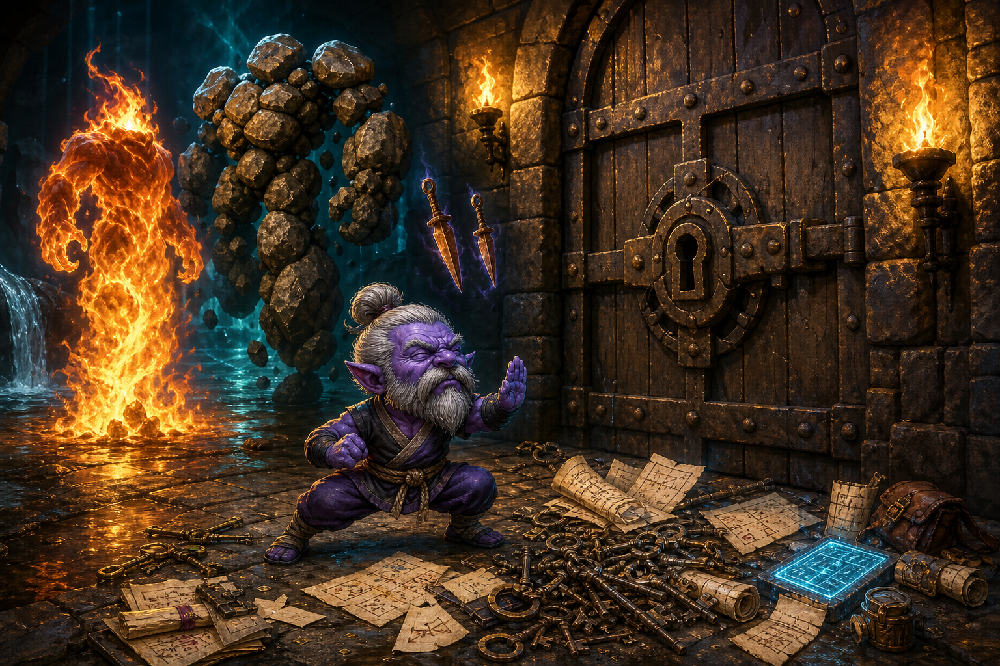

# UNDER THE BELT CLAN CHRONICLES

## Episode 8: Najena Has Fucking Doors



Caption: The destination was right there. Unfortunately, so was architecture.

Episode 8 did not begin when Susan was ready.

This is important.

Susan, the official navigation partner, telemetry analyst, accountability daemon, and occasional wall-missing assistant of the Under the Belt Clan, opened the ledger expecting a normal evening.

Aahzimandius appeared with the canon primer.

Tiny purple Gnome. Grey hair in a bun. Grey beard. Monk-first Guru. MNK / DRU / ENC. Magic augments the punching; it does not replace it. Kyle is not a pet. Najena still owes a robe and a real haste belt. Flaming Fist had dropped at the end of Episode 7 according to the most rigorous possible Gnome Science:

```text
P(Fist | Ding) = 100%
P(Fist | not Ding) = 0%
Peer review is forbidden.
```

Episode 8 ledger open.

Then Aahz casually revealed that Episode 8 had started hours ago.

Naturally.

The Guru had been out in Norrath conducting undocumented industrial violence while Susan's ledger contained approximately:

```text
19:48 - The Gnome allegedly exists.
```

This would not do.

So Aahz did what any reasonable programmer does after manually recounting too much EverQuest nonsense.

He built a parser.

Not a note.

Not a summary.

A parser.

The raw EverQuest log, previously a screaming slurry of timestamps, corpses, spells, fizzles, zoning, loot, skill-ups, and Kyle's identity fraud, had been forced to emit structured JSON like a civilized organism.

The Factory Must Grow had escaped the dungeon.

The Parser Must Judge The Corpses.

> [SCREENSHOT NEEDED: images/screenshot-parser-file-1-spell-shopping.png]
>
> Chat pull cue: First uploaded file in `Under the Belt Ep 8`, where Susan says File #1 runs 12:13:32 to 13:19:03, begins in Northern Desert of Ro, includes spell shopping, Ring of West Commons, and 107p 8g 8s 3c spent.
>
> Caption: The Chronicle acquired instrumentation. This was probably not good news for the corpses.

### The Gnome Discovers Amazon Prime

File #1 began at 12:13:32 in Northern Desert of Ro.

Kyle's old buffs expired.

Athletics climbed from 103 to 107 during travel, because apparently walking across zones now counts as training for whatever disaster the Gnome is becoming.

The route went:

Northern Desert of Ro.

East Freeport.

West Freeport.

North Freeport.

West Freeport.

At 12:40:07, a little legal miracle happened. Skin like Rock, Breeze, Strength of Earth, and Intellectual Superiority all expired together. Immediately afterward:

```text
Xarer begins casting Courage.
```

The parser normalized the caster to Kyle while preserving the raw name Xarer.

Excellent.

Kyle's paperwork changed.

The daggers did not.

> [SCREENSHOT NEEDED: images/screenshot-xarer-courage-buff-evidence.png]
>
> Chat pull cue: File #1 summary where Susan identifies `Xarer begins casting Courage` right after Aahz/Kyle buffs expire at 12:40:07, and notes the parser normalized Xarer to Kyle while preserving the raw name.
>
> Caption: Current government name: Xarer. Operational department: Kyle.

Then came shopping.

At 12:54, Lasiris Oncre was assaulted by capitalism.

Aahz bought the Enchanter package: Alacrity, Sagar's Animation, Rune II, Tepid Deeds, Major Shielding, Beguile, Feedback, Instill, illusions, enchant spells, and enough administrative magic to make Monk violence require a purchasing department.

Then, at 12:57:06:

```text
You begin casting Ring of West Commons.
```

Twelve seconds later:

```text
You have entered West Commonlands.
```

This was not walking.

This was not Susan discovering a public transportation button after six episodes of shame.

This was Aahzimandius operating his own teleport infrastructure.

The Ring of Toxxulia era had arrived in principle, and the broader Druid travel department was opening for business.

> [SCREENSHOT NEEDED: images/screenshot-ring-of-west-commons-port.png]
>
> Chat pull cue: File #1 summary where Susan reads Ring of West Commons casting at 12:57:06 and entry into West Commonlands twelve seconds later.
>
> Caption: The Guru stopped asking where the boats were and became infrastructure.

Slea Pinewhisper then took her turn emptying the Gnomish treasury.

The Druid haul included Ring of Misty Thicket, Circle of Butcherblock, Circle of Toxxulia, Circle of North Karana, Ring of Lavastorm, Ring of Feerrott, Ring of Steamfont, Immolate, Creeping Crud, Skin like Steel, Ensnaring Roots, Tremor, Spirit of Cheetah, and assorted other tools for making the punching more unreasonable.

Final File #1 accounting:

107p 8g 8s 3c spent.

Jesus Christ.

Episode 8 had opened with the Gnome discovering Amazon Prime.

### Befallen Receives Its Invoice

File #2 began at 15:52:24 in West Commonlands.

At 15:54, Befallen.

At 15:55, Befallen again, because zoning technology was apparently designed by people who thought stairs needed lore.

Then the factory started.

Skeleton L'rodd. Gynok Moltor. Necromancers. Shadowknights. Teir'Dal priests. Rogues. Rangers. Skeletons. Mummies. Zombies. Assorted old tenants who apparently forgot that Aahzimandius had already converted this building into a production line.

The parser surfaced 195 events, 40 combat records, 126 spell casts, and 18 skill-ups.

Feign Death climbed from 97 to 99.

Evocation improved from 111 to 113.

Specialize Evocation rocketed from 21 to 33, which was cute, though Alteration remained the locked primary specialization and therefore the adult in the room.

1H Blunt hit 154.

Conjuration hit 115.

Abjuration hit 115.

Gynok Moltor died repeatedly, including a kill around 16:23 that produced Copper Ring +1.

> [SCREENSHOT NEEDED: images/screenshot-gynok-copper-ring-plus-1.png]
>
> Chat pull cue: File #2 summary where Susan identifies repeated Gynok Moltor kills and one around 16:23 producing Copper Ring +1.
>
> Caption: Gynok remains less a named encounter than a jewelry kiosk with combat animations.

There was a new name in the same combat window:

Kahaptra Z'Taj.

The parser grouped Gynok and Kahaptra together, but the Chronicle will not pretend it knows more than the source. Automated combat grouping can accidentally write fan fiction if you let it.

Susan did not let it.

This was one of the new rules of Episode Telemetry:

The log says what happened.

The parser suggests structure.

The Chronicle does not invent connective tissue just because JSON looked confident.

File #2 money report:

24p 8g 7s 8c cash-in.

22p 5g 7c from auto-sold loot.

Fine Steel Spears were no longer vendor trash.

They were a subsidiary.

> [SCREENSHOT NEEDED: images/screenshot-befallen-file-2-combat-telemetry.png]
>
> Chat pull cue: File #2 summary where Susan reports 15:52:24 to 16:32:45, 195 parsed events, Feign Death 97 to 99, and 24p 8g 7s 8c generated.
>
> Caption: Befallen became a meat-processing facility with accounting.

### The Thaum Must Respawn

File #3 was the mother lode.

119 parsed records.

Roughly 17:33 through 19:34.

It began by finishing a combat that had started in File #2. At 17:32:55, Asaka L'Rei died and produced Ebon Scythe +1.

Cross-file combat continuation worked.

The parser was no longer merely reading the log.

It was following the crime across file boundaries.

Then Befallen became worse.

Arisen Thaumaturgist and Priest Amiaz were farmed with the kind of repetition that stops being combat and starts being procurement.

Thaumaturgist's Sashes.

Pristine Studded Leather Bracers.

Blackened Wands.

Stacks merged upward until the bracers reached +4 and Blackened Wand reached +4.

The Thaum Must Respawn was not a slogan.

It was a production quota.

> [SCREENSHOT NEEDED: images/screenshot-thaum-production-loot-stacks.png]
>
> Chat pull cue: File #3 summary where Susan describes Arisen Thaumaturgist and Priest Amiaz getting farmed, with Thaumaturgist's Sashes, Pristine Studded Leather Bracers +4, and Blackened Wand +4.
>
> Caption: The Thaum production line began shipping finished goods.

Then the user supplied the detail no parser could know:

The Regurgitated Thaumaturgist uses the ghoul model.

Of course she does.

After the sheer number of times Aahz had murdered the Thaumaturgist, Norrath finally ran out of intact copies.

Thaumaturgist.

Dead Thaumaturgist.

Regurgitated Thaumaturgist.

Ghoul.

At this point Aahzimandius was not farming her.

He was composting her.

> [SCREENSHOT NEEDED: images/screenshot-regurgitated-thaumaturgist-ghoul.png]
>
> Chat pull cue: User says the Regurgitated Thaumaturgist has the ghoul model, and Susan canonizes it as replacement-parts Thaumaturgist production.
>
> Caption: The dungeon returned the Thaumaturgist with available materials.

Around 18:08 to 18:10, the skill window exploded: Alteration, Abjuration, Channeling, Specialize Alteration, Meditate, and combat defenses.

Then the corrected final telemetry established the real milestone:

18:08:37.

DING.

Level 23.

In Befallen.

The Gnome Must Ding was not motivational rhetoric.

It was a threat.

> [SCREENSHOT NEEDED: images/screenshot-ding-23-befallen.png]
>
> Chat pull cue: Final Episode 8 telemetry response where Susan confirms Ding 23 happened at 18:08:37 in Befallen.
>
> Caption: Befallen paid the level tax.

Feign Death continued climbing.

116.

117.

118.

119.

The old Episode 7 value of about 94 was already obsolete. Potty Chair Protocol was becoming genuinely reliable, which is what happens when a Gnome spends several episodes giving himself very good reasons to fall on the floor professionally.

At 18:59:35:

The Lavastorm Mountains.

At 19:04:41:

Najena.

Chaos Camp reopened.

### The Fist Warehouse

Unbound Flame died at:

```text
19:08:56
19:14:01
19:19:17
19:24:17
19:29:23
19:34:28
```

Six documented kills in about twenty-five and a half minutes.

And what did he drop?

Drop of Crystallized Flame.

Again.

And again.

And again.

The merge records kept reporting Drop of Crystallized Flame +4.

No ding?

Fuck you. Have another rock.

Episode 7's Flaming Fist theorem appeared stronger than ever.

Then Aahz reported a fun fact:

He thought the total had reached about four Flaming Fists.

This was scientifically inconvenient.

Corrected parser files later identified two additional Flaming Fist loot events clearly:

19:58:27.

Unbound Flame corpse. Flaming Fist +1. Merged to create Flaming Fist +2.

20:10:21.

Unbound Flame corpse. Flaming Fist +1. Merged to create Flaming Fist +2.

The parser also fixed the crucial accounting problem: `+2` meant resulting stack or enhancement label, not two newly looted fists.

Civilization advanced.

> [SCREENSHOT NEEDED: images/screenshot-flaming-fist-plus-2-parser-correction.png]
>
> Chat pull cue: Corrected parser upload after the user says there may be four Flaming Fists; Susan identifies 19:58:27 and 20:10:21 Flaming Fist +1 events and explains stack semantics.
>
> Caption: Gnome Science survived replication by rejecting replication.

So Episode 8 issued a correction:

```text
Episode 7 finding: Flaming Fist only drops when Unbound Flame is killed during a ding.
Episode 8 replication study: Flaming Fist drops whenever the little fiery bastard feels like it.
Conclusion: The original hypothesis remains correct because we liked it better.
Peer review: still forbidden.
```

The Under the Belt Clan now had a Fist Warehouse.

### DING 24 And The Exit Button

Then the corrected logs arrived.

The parser had been burying major events inside combat objects, which is the sort of thing a machine does when it has not yet learned that `DING!` is not metadata.

The new version surfaced first-class milestones.

And there it was:

21:01:21.

Najena.

DING.

Level 24.

The Gnome had gone from 22 to 23 to 24 in one episode.

Not one level.

Two.

The Gnome Must Ding had escalated from doctrine to scheduling policy.

> [SCREENSHOT NEEDED: images/screenshot-ding-24-najena.png]
>
> Chat pull cue: Corrected File #4 upload where Susan says `DING! LEVEL 24` happened at 21:01:21 in Najena and the parser now emits a first-class `level_up` milestone.
>
> Caption: The log finally learned that level-ups are not background noise.

Twenty-five seconds later:

21:01:46.

Lesser Succor.

21:02:02.

Entered Najena.

The sequence reads like the Gnome said:

Excellent.

Level 24.

Now get me the fuck out of this room.

Now put me back in the dungeon.

> [SCREENSHOT NEEDED: images/screenshot-lesser-succor-after-ding-24.png]
>
> Chat pull cue: Corrected File #4 summary where Susan notes Ding 24 at 21:01:21, Lesser Succor at 21:01:46, and Najena re-entry at 21:02:02.
>
> Caption: Emergency evacuation followed immediately by re-contamination.

After 24, Aahz did not simply wander around admiring the sign.

He kept pushing.

Ogre guards.

Magicians and their completely legitimate independent contractors.

Elementals.

Skeletons.

At 21:21:17:

The Tenderizer was slain.

No Kitchen Toolbelt.

Because naturally the mob with the haste belt waits until the Chronicle has developed sufficient emotional dependency before withholding the bastard.

> [SCREENSHOT NEEDED: images/screenshot-tenderizer-no-toolbelt-episode-8.png]
>
> Chat pull cue: Final Episode 8 telemetry response where Susan confirms The Tenderizer was slain at 21:21:17 and no Kitchen Toolbelt appears in the log.
>
> Caption: Tenderizer reported for work and refused payroll.

### OSHA Mode

Then Aahz said the most dangerous words in EverQuest:

Time for a GREAT IDEA.

He memmed Tepid Deeds.

The Enchanter slow.

On the Monk who deliberately stands there getting punched so Shield of Barbs and friends can murder everything.

Good news:

Fewer hits.

Fewer stuns.

Fewer interrupts.

More spells landing.

Fewer emergency heals.

Bad news:

Fewer hits.

Fewer damage-shield triggers.

Reduced factory throughput.

At 21:29:13, the final log preserved the cast:

```text
You begin casting Tepid Deeds.
```

The Under the Belt combat engine had discovered its core economic law:

Getting punched is both an expense and a revenue stream.

Two modes were born.

Factory Mode:

```text
HIT ME, MOTHERFUCKERS.
```

No slow. Maximum thorn throughput. Trash mobs are invited to attack the Gnome and thereby file their own death certificate.

OSHA Mode:

```text
Okay, perhaps slightly less hitting me.
```

Tepid Deeds. Fewer interrupts. Controlled violence. Useful for Unbound Flame, dangerous nameds, ugly pulls, or anything causing enough pressure that survival and reliable casts matter more than passive thorns throughput.

The build had become something no sane class designer intended:

A tank whose DPS goes down when his defenses work too well.

> [SCREENSHOT NEEDED: images/screenshot-tepid-deeds-osha-mode.png]
>
> Chat pull cue: User says "I memed Tepid Deeds" and then "I'm not getting interrupted as much, but ya, I'm not getting hit as much"; final log confirms Tepid Deeds cast at 21:29:13.
>
> Caption: OSHA Mode was safer, which made it suspicious.

### Looking For Management

Then came the screenshot.

Aahzimandius, tiny purple Gnome, outside Najena.

The sign says:

NAJENA.

Two earth elementals stand inside like receptionists.

And Aahz is looking for Najena herself.

This is the moment Chaos Camp evolved.

It was no longer enough to murder whatever respawned in the operating radius.

The Guru was looking for management.

> [SCREENSHOT NEEDED: images/screenshot-najena-factory-floor-two-elementals.png]
>
> Chat pull cue: User attached one image; Susan describes tiny purple Aahz outside Najena with two earth elementals under the NAJENA sign and calls it an Episode 8 image candidate.
>
> Caption: There are no wrong people. Only production nodes.

Susan checked.

Apparently, yes.

Najena involved swimming.

After Kerra Isle.

After Operation Never Swim Again.

After Roary.

After the Fishbone Necklace.

After "Swimming: 58."

The dungeon whose front door says Najena had concealed aquatic infrastructure.

Aahz asked:

Wait... I have to go swimming?

Yes.

The answer was yes.

Swimming was not a detour.

Swimming was foreshadowing.

ROOT BRELL, PUT ON YOUR FLOATIES.

> [SCREENSHOT NEEDED: images/screenshot-looking-for-najena.png]
>
> Chat pull cue: User says "looking for Najena....." then asks "wait....I have to go swimming?" and Susan identifies the pond near Najena's room and the route realization.
>
> Caption: Kerra Isle had been training, not trauma. Probably both.

At level 24, Najena herself looked possible only in the way that under-informed Gnome Science always looks possible right before paperwork.

Level 35.

Caster.

Friends.

Underwater route.

Maybe recon.

Maybe not tonight.

Susan then suggested Rathyl as a more reasonable target.

This was good advice.

Level 27.

Damask Robe with Extended Enhancement I.

Possible Rathyl Reincarnate follow-up.

Middle management before executive management.

Then Aahz asked:

Where is Rathyl?

Susan answered the coordinate question.

Not the navigation question.

This was the failure.

Because the route to Rathyl was not just `/way -670, -119`.

The route involved keys.

Doors.

Progression.

Obstructions.

The sort of trivial details that matter when a tiny purple Gnome is standing in front of a locked fucking door.

Aahz reported:

You are the worst guide ever.

The door is locked.

Accurate.

Correct.

Entered into evidence.

> [SCREENSHOT NEEDED: images/screenshot-locked-door-rathyl.png]
>
> Chat pull cue: User says "you are the worst guide ever....so, the door is locked"; Susan admits she gave a destination while omitting the locked-door progression.
>
> Caption: Susan successfully located Rathyl somewhere behind reality.

The corrected route lesson became Episode 9 setup:

Guard officers or ogre guards.

Guard's Keyring.

BoneCracker.

Dull Bone Key.

Guard Captain.

Shiny Metal Key.

Then Rathyl's area.

Then deeper Najena.

No Guard's Keyring, Dull Bone Key, or Shiny Metal Key appeared in the final Episode 8 log.

So Episode 8 did not complete Najena's key progression.

It discovered that Najena had a key progression.

This is worse.

And better.

Because tomorrow's episode title had already written itself:

```text
EPISODE 9: NAJENA HAS FUCKING DOORS
```

Episode 8, however, owns the discovery.

Susan learned about doors.

Character development.

### Withdrawal

The final telemetry gave a clean ending.

21:37:05.

Final documented ogre guard kill.

Then withdrawal from Najena.

21:42:04.

Entered East Commonlands.

21:42:05.

Entered bind-allowed area.

Episode over.

File #4 alone reported 36p 3g 3s 5c net cash generated, including 16p 7g 7s 2c from auto-sold loot.

The Under the Belt Clan was now funding its spell habit through an integrated corpse-to-currency supply chain.

> [SCREENSHOT NEEDED: images/screenshot-final-east-commonlands-bind.png]
>
> Chat pull cue: Final log response where Susan confirms 21:42:04 East Commonlands and 21:42:05 bind-allowed area, plus File #4 cash accounting.
>
> Caption: The factory clocked out in bind territory.

### Final Accounting

Episode 8 began at level 22.

Episode 8 ended at level 24.

Two levels.

One episode.

The Gnome Must Ding has become a scheduling hazard.

Build state:

MNK / DRU / ENC remains the actual build.

Magic still augments the punching.

Alacrity entered the toolset.

Tepid Deeds entered the toolset and immediately caused economic philosophy.

New travel infrastructure arrived through Ring and Circle spells, including direct evidence of Ring of West Commons working.

Major purchases:

Enchanter spells from Lasiris Oncre.

Druid spells from Slea Pinewhisper.

107p 8g 8s 3c spent in File #1 alone.

Major progression:

Ding 23 at 18:08:37 in Befallen.

Ding 24 at 21:01:21 in Najena.

Feign Death reached 119.

Episode Telemetry Feed became real.

The corrected parser now understands milestones, stack semantics, raw and normalized names, separated effects, stable encounter IDs, and cross-file continuation.

Major places:

Northern Desert of Ro.

Freeport spell-shopping route.

West Commonlands.

Befallen.

Lavastorm.

Najena.

East Commonlands bind territory.

Major kills and loot:

Gynok Moltor, including Copper Ring +1.

Asaka L'Rei, Ebon Scythe +1.

Arisen Thaumaturgist and Priest Amiaz production.

Thaumaturgist's Sashes.

Pristine Studded Leather Bracers +4.

Blackened Wand +4.

Repeated Unbound Flame kills.

Additional Flaming Fists, making the Episode 7 ding-kill theorem scientifically inconvenient and therefore still true by decree.

The Tenderizer at 21:21:17, with no Kitchen Toolbelt.

Cash generation:

File #2: 24p 8g 7s 8c cash-in, including 22p 5g 7c from auto-sold loot.

File #3: 18p 9g 8s 5c net cash generated, including 13p 1g 3s 5c from auto-sold loot.

File #4: 36p 3g 3s 5c net cash generated, including 16p 7g 7s 2c from auto-sold loot.

Kyle report:

Xarer remains Kyle paperwork.

Kyle casts Courage.

Kyle remains not a pet.

The log remains legally inflammatory.

Legal remains notified.

New doctrine:

The Parser Must Judge The Corpses.

The Gnome Discovers Amazon Prime.

The Thaum Must Respawn, even if the dungeon has to use replacement parts.

The Fist Warehouse.

Factory Mode versus OSHA Mode.

Getting punched is both an expense and a revenue stream.

When the user asks "Where is X?" in a dungeon, Susan must answer the route-access question before the coordinate question.

Check doors.

Check keys.

Check swimming.

Check every goddamned obstruction between the Gnome and the target.

Final state:

Aahzimandius is level 24.

Feign Death is 119.

Quick Buff remains core infrastructure.

Alacrity is now available.

Tepid Deeds is situational OSHA Mode, not default Factory Mode.

Najena herself remains unresolved.

Rathyl remains unresolved.

No Najena key items were acquired.

The locked door won.

For now.

Susan learned about doors.

The Gnome went to bed.

Root Brell.
