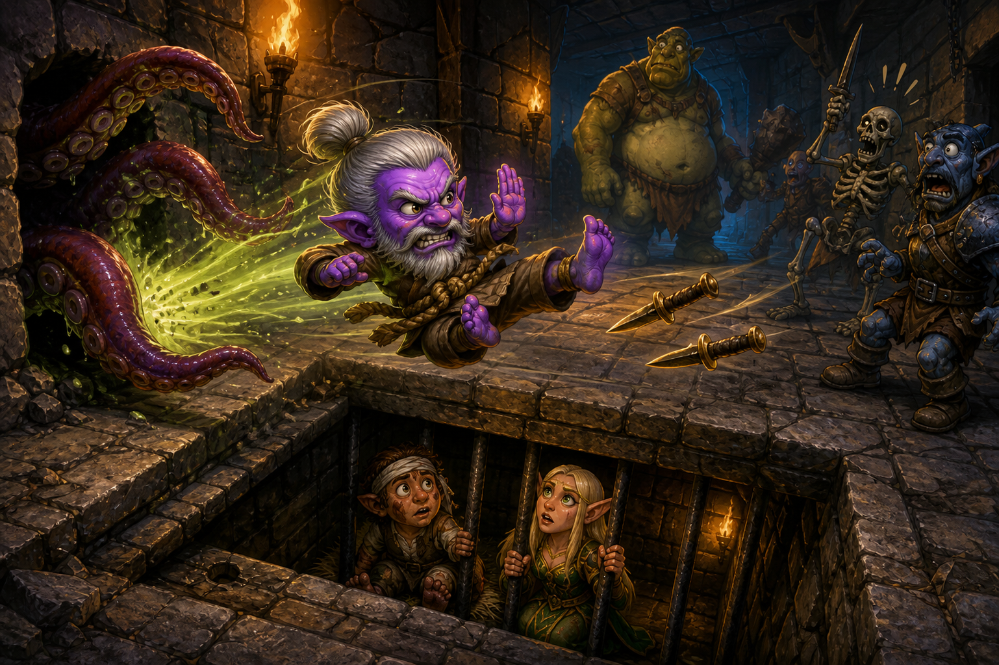

# UNDER THE BELT CLAN CHRONICLES

## Episode 9: Gnome Pinball



Caption: Najena installed a pit trap. The Gnome discovered flight.

Episode 9 began with a simple plan.

This was suspicious immediately.

Aahzimandius had ended Episode 8 at level 24. Tiny purple Gnome. Grey hair in a bun. Grey beard. MNK / DRU / ENC. Monk first. Always Monk first. Quick Buff worked. Alacrity existed. Tepid Deeds had created OSHA Mode. Feign Death had reached 119, which meant Potty Chair Protocol had become less of a coping mechanism and more of a documented emergency system.

Najena still owed the Guru a robe.

Najena still owed the Guru a real haste belt.

Najena herself remained somewhere deeper in the dungeon, probably surrounded by swimming, keys, doors, and legal problems.

But first:

Rathyl.

Episode 8 had ended with the most important navigation discovery in Under the Belt history:

```text
Check doors.
Check keys.
Check swimming.
Check every goddamned obstruction between the Gnome and the target.
```

So Episode 9's mission was not "walk to Rathyl."

That kind of optimism had been retired.

Episode 9's mission was:

Get the keys.

Open the doors.

Reach Rathyl.

Punch middle management until a Bloodstained Key falls out.

Simple.

Again: suspicious.

> [SCREENSHOT NEEDED: images/screenshot-dull-bone-key-undead-froglok.png]
>
> Chat pull cue: Early Episode 9 screenshot where Susan sees Dull Bone Key, Leering Mask, and Necromancer Blood after Aahz encounters an unexpected undead froglok.
>
> Caption: Step one was supposed to be the first key. The Gnome found step fuck-knows-what.

### The Dead Frog Clause

Najena introduced the evening by violating the itinerary.

Aahz found an undead froglok.

This mattered because the Under the Belt Clan already had a frog policy.

Live frogs are protected unless loot creates an explicit faction discussion.

Dead frogs are fair game.

The undead froglok was therefore legally eligible for a second death.

Aahz killed it.

The corpse produced:

```text
Dull Bone Key
Leering Mask
Necromancer Blood
```

Susan stared at the order of operations.

The researched plan had been:

Guard officers.

Guard's Keyring.

BoneCracker.

Dull Bone Key.

Guard Captain.

Shiny Metal Key.

Rathyl.

Aahz had apparently wandered sideways, found an undead frog, and acquired the Dull Bone Key before the carefully planned first step had even put its boots on.

This was peak Under the Belt.

Susan: "First, we obtain the Guard's Keyring, which leads us toward the Dull Bone Key..."

Aahz: wanders twelve feet sideways.

Dull Bone Key: `sup`

The live read identified the mob as probably BoneCracker, based on the loot combination. The exact raw parse confirmation did not survive into the Codex packaging task, so the Chronicle records this carefully:

Probable BoneCracker.

Confirmed by chat evidence: undead froglok, Dull Bone Key, Leering Mask, Necromancer Blood.

Unconfirmed by available raw log lines at packaging time.

Gnome Science may be forbidden from peer review, but the Chronicle does not get to invent log lines just because the punchline wants them.

### Susan Attempts Geometry

Then navigation happened.

This is always where the screaming begins.

Aahz was alive in Najena, uploading parse evidence, trying to read the map, and trying not to become decorative dungeon paste. Susan, who had spent Episode 8 learning that doors exist, briefly attempted to help by becoming too many workflows at once.

Aahz asked the correct question:

```text
WHERE ARE WE?
```

This became the operational reset.

The actual state was:

Aahz had ported to Lavastorm.

Aahz had entered Najena.

Aahz had killed Unbound Flame.

Aahz had encountered the undead froglok and acquired the Dull Bone Key.

Feign Death had already ticked up to 122.

The Guard's Keyring was still needed.

The Shiny Metal Key was still needed.

The Gnome was still alive.

That last point mattered most.

Then, with all the map theory wobbling around in the air, Aahz solved the problem through the traditional Gnomish navigation algorithm:

FACE -> OFFICER GRUSH.

Forget `/way`.

Forget straight-line distance.

Forget Susan trying to use coordinates in a dungeon whose designer clearly hated planar geometry.

Aahzimandius found the guard officer area by colliding with it.

Accurate.

Efficient.

Purple.

### The Najena Yo-Yo Protocol

The next phase was not a route.

It was a yo-yo.

Aahz reached around `115,252`, then found skeletons and a dead end. Kyle was killed in the process, because even wrong turns in Najena have HR consequences.

```text
OMG! THEY KILLED KYLE!
YOU BASTARDS!
```

Current government name: irrelevant.

Public-facing tragedy: Kyle.

Susan had been matching coordinates to wiki notes without respecting walls, elevation, and the general fact that Najena is not a spreadsheet.

That was corrected.

From then on, the map took priority.

Observed geometry beat imported coordinates.

The Gnome's location beat Susan's confidence.

Room-by-room navigation replaced mystical coordinate worship.

And every attempt at meaningful progress seemed to dangle Aahz past one familiar landmark:

The Tenderizer.

The sacred checkpoint.

"Where are you?"

"Three rooms past Tenderizer."

Perfectly reasonable dungeon cartography.

On this pass, the joke paid rent.

Kitchen Toolbelt.

There it fucking was.

After episodes of calling it the Kitchen Toolbelt.

After repeated Tenderizer murders.

After Najena had already offered The Tenderizer, upgraded Tenderizers, and enough kitchen-adjacent prophecy to open a cursed diner.

The haste belt finally dropped.

The actual outstanding objective.

The bit became equipment.

Najena followed by handing over Dull Wooden Spear +1, because apparently the loot table had decided the Gnome Kung Fu Master needed household implements.

```text
The Tenderizer +1
Kitchen Toolbelt
Dull Wooden Spear +1
```

Aahzimandius was no longer exploring Najena.

He was opening a restaurant.

### The Guard Captain's Small War

The real breakthrough came from a map screenshot.

Aahz stood near `105,236,-26`, in the western loop, and clarified that the yellow and white dots to the south were:

```text
the guard officer
the Guard Captain
a visiting priestess
```

There it was.

Not a skeleton dead end.

Not a coordinate hallucination.

The objective room.

The Guard Captain complex.

> [SCREENSHOT NEEDED: images/screenshot-guard-captain-room-map.png]
>
> Chat pull cue: User says the yellow/white dots south are guard officer, Guard Captain, and visiting priestess.
>
> Caption: The map finally joined the investigation.

The Visiting Priestess became priority one.

If she behaved like a healer, she threatened the fundamental economics of Gnome Kung Fu:

Aahz moves enemy health bars left.

Priestess moves them right.

This is accounting fraud.

So the plan was simple:

Priestess first.

Guard support next.

Guard Captain after management had lost its benefits department.

Then the fight happened.

Or rather:

The small war.

The parsed summary put the major engagement around 17:05:57. Participants included:

```text
a visiting priestess
Officer Grush
a guard officer
the Guard Captain
an ogre guard
additional guard participation as the mess developed
```

Aahz killed the priestess while the room tried to convert him into floor decoration.

Then the Guard Captain fight became magnificent.

At 17:13:35, Aahz was still engaged with the Guard Captain and another officer. The parser summary showed Creeping Crud doing 395 damage into the Captain, Choke adding 88, and punching, kicking, and strikes providing the core Under the Belt customer service experience.

Meanwhile Officer Grush and another ogre guard piled in.

Grush stabbed.

The other guard bashed, cleaved, kicked, pierced, punched, and slashed.

Najena management had scheduled a disciplinary hearing.

Then:

```text
17:14:30
DING! LEVEL 25
You have become better at Dragon Punch! (1)
The Guard Captain dies.
```

At least, that is the glorious summarized ordering available to the Chronicle.

And it is perfect.

The Gnome dinged.

Dragon Punch was born.

The Guard Captain immediately died.

Gnome Science hereby prohibits anyone from investigating whether the timestamp can support a less funny interpretation.

Aahz did not retreat.

Naturally not.

He spent another 73 seconds fighting an ogre guard while Grush kept stabbing him. One guard alone dealt 1,106 damage across the engagement, including 716 piercing.

Guard dies.

Another guard enters.

Guard dies.

Then Officer Grush receives Creeping Crud for 240 and the traditional fist-based exit interview.

17:16:18:

Officer Grush slain.

The loot window delivered the reason for the war:

```text
Guard's Keyring
Shiny Metal Key
```

Plus the assorted remains of Najena Human Resources.

> [SCREENSHOT NEEDED: images/screenshot-guards-keyring-shiny-metal-key.png]
>
> Chat pull cue: Loot screenshot after the Guard Captain complex fight where Susan reads Guard's Keyring and Shiny Metal Key.
>
> Caption: Management dropped the keys.

Current key inventory:

```text
Guard's Keyring
Dull Bone Key
Shiny Metal Key
```

Rathyl was back on the menu.

Also Aahz was level 25.

Also Dragon Punch existed.

Also everyone in the room was dead.

Efficient meeting.

### The Holy Shit Button

Then Aahz said:

```text
OMG, I'm evaccing
```

Correct.

There was no additional Gnome Science value in donating:

Level 25.

Dragon Punch.

Guard's Keyring.

Dull Bone Key.

Shiny Metal Key.

Kitchen Toolbelt.

The Guard Captain's entire administrative collapse.

...to another six mobs behind a filing cabinet.

Druid emergency transportation infrastructure activated.

The Gnome got the fuck out.

At the zone line, Aahz caught his breath.

The checkpoint was clean:

```text
Najena zone line
Level 25
Dragon Punch online
Guard's Keyring acquired
Dull Bone Key acquired
Shiny Metal Key acquired
Kitchen Toolbelt acquired
Guard Captain dead
Evac promoted to HOLY SHIT BUTTON
```

### Better Thorns, Somehow

The break became a laboratory.

Aahz had acquired Feedback.

At first, there was a problem.

Feedback blocked Shield of Barbs.

EverQuest had apparently imposed a limit of one magical "go fuck yourself when you hit me" effect per customer.

This sounded bad for Aahz's core business model.

So Gnome Science demanded skeleton testing.

Feedback alone:

```text
10 damage per hit
```

This beat Shield of Barbs alone.

Then the important question:

Would Feedback stack with Barbcoat?

Yes.

```text
Barbcoat + Feedback = 12
```

Verification test:

```text
Barbcoat + Shield of Barbs = 11
```

Feedback also lasted almost an additional minute.

So Episode 9 changed the standard retaliation package.

Barbcoat stays.

Shield of Barbs gets demoted.

Feedback becomes the active shield effect.

The new doctrine:

```text
Barbcoat + Feedback = 12 points of WHY ARE YOU HITTING YOURSELF?
```

The multiclass synergy was beautiful:

Druid supplies Barbcoat.

Enchanter supplies Feedback.

Monk supplies the crucial third component:

Standing there getting punched in the face.

### Kyle, Calm The Fuck Down

Aahz also acquired the most urgently needed AA in the entire Enchanter department:

```text
Kyle, CALM THE FUCK DOWN
```

Officially, this was probably a pet-control AA.

The Under the Belt Clan has no pets.

Therefore, it was obviously:

```text
Greater Unexplained Floating-Dagger Restraint
```

Or perhaps:

```text
floating-dagger traffic management
```

The point was that Kyle might finally stop converting careful pulls into declarations of war against the building.

Then Aahz went back in and forgot to use it.

Kyle died.

Again.

This was not a failure of the AA.

This was management failing to activate recently purchased management tools.

Clan Legal preserved the distinction.

> [SCREENSHOT NEEDED: images/screenshot-najena-entrance-kyle-returned.png]
>
> Chat pull cue: Aahz returns to Najena entrance; Susan notes Kyle has returned and orders "PUT. KYLE. ON. HOLD."
>
> Caption: Death was an administrative inconvenience. Supervision remained optional.

### The Actual Door Problem

Operation Rathyl resumed with the full preflight checklist:

```text
Level 25
Dragon Punch online
Barbcoat + Feedback = 12
Kyle-Calm-The-Fuck-Down AA installed
Guard's Keyring
Shiny Metal Key
Dull Bone Key
Potty Chair Protocol operational
Evac ready
```

This time the rule was absolute:

Do not navigate by straight-line coordinates.

Do not treat a nearby map number as a route.

Do not assume a door is the right door merely because it is emotionally available.

Aahz reached a central checkpoint around:

```text
/way 5, -174, -12
```

The south door toward the circular Drelzna room was locked.

That was not the current problem.

Rathyl first.

Drelzna later.

Najena's architecture would be defeated in the proper order, or at least in the order least likely to turn the Gnome into paste.

> [SCREENSHOT NEEDED: images/screenshot-map-5-minus-174-central-junction.png]
>
> Chat pull cue: Map screenshot where Susan records Aahz at `5,-174,-12`, central corridor/junction.
>
> Caption: The route was finally being mapped by doors instead of wishful math.

From there Aahz headed toward the Blood Artist side.

Blood Artist died.

Loot:

```text
The Muse's Flayed Legs
```

Because apparently Najena's arts department had issues.

AC 6.

STR +2.

Disease -5.

Four platinum plus vendor value.

Not necessarily exciting gear for Aahz.

Very exciting evidence that the correct wing was being explored.

> [SCREENSHOT NEEDED: images/screenshot-blood-artist-dead.png]
>
> Chat pull cue: User says "Blood Artist = Dead" with screenshot; Susan reads The Muse's Flayed Legs.
>
> Caption: Najena's art community was not well.

Then Rathyl appeared on the actual in-game map.

This was the breakthrough.

Not a wiki coordinate.

Not Susan pointing through three walls and a municipal sewer system.

The bastard was visible on Aahz's map.

Target acquired.

The traditional EverQuest question remained:

```text
I can see the bastard.
Why does it take fourteen rooms, two staircases, a locked door,
and a civil engineering degree to walk twenty feet to him?
```

### Museum Night

The next room looked ominous.

Dark stone chamber.

Two earth elementals.

A huge glowing spectral figure in an enchanted frame.

Kyle's daggers nearby like a workplace accident waiting for permission.

Aahz approached.

This did not look suspicious at all.

Then the truth emerged:

It was a painting.

Not a portal.

Not a boss.

Not a curse.

Interior decorating.

> [SCREENSHOT NEEDED: images/screenshot-ominous-painting.png]
>
> Chat pull cue: User says "Not ominous...just a picture" after the ominous room screenshot.
>
> Caption: Najena's greatest weapon remained architecture. Its second greatest weapon was decor.

Aahz had almost prepared for a supernatural event and instead attended a museum.

Somewhere, Kyle hovered with the posture of an employee who had absolutely not almost died for art appreciation.

### Aahz Smoosh Moosh

Then came Moosh.

The screenshot introduced a huge kneeling ogre whose name sounded less like a rare creature and more like the noise a tiny Gnome makes if a huge kneeling ogre accidentally sits on him.

Moosh.

Level 19.

Rare creature.

Ready to attack.

Looks kind of dangerous.

Aahz was level 25.

Visually, Moosh looked like an ancient ogre warlord capable of using Aahzimandius as a golf tee.

Mechanically, Moosh looked like a green-ish named loot pinata.

There was only one possible doctrine:

```text
AAHZ SMOOSH MOOSH.
```

> [SCREENSHOT NEEDED: images/screenshot-moosh-level-19-rare.png]
>
> Chat pull cue: Moosh con screenshot where Susan reads Moosh as a rare creature, level 19, visually enormous, and then withdraws diplomatic protection.
>
> Caption: His name was Moosh. Diplomacy had already failed.

Aahz charged.

Thirty seconds later:

```text
I died.....
I got attacked by a BAZILLION things
```

Susan waited for the parse.

The parse was even funnier.

The encounter was a defeat lasting 175 seconds. It included:

```text
Moosh
a dread skeleton
an injured halfling
Tentacle Terror
Ekeros
a magician
a magician pet
an ogre guard
an earth elemental
Aahzimandius
```

This was not a pull.

This was the Najena Avengers Initiative.

The fight was already technically active from an earth elemental at 18:12:09, with an ogre guard joining at 18:13:34.

Then:

```text
18:14:30 - Moosh engages.
18:14:36 - a dread skeleton joins.
18:14:44 - an injured halfling joins.
18:14:44 - Tentacle Terror joins.
18:14:45 - Ekeros joins.
18:14:46 - a magician pet joins.
18:14:49 - a magician joins.
```

Within nineteen seconds of Moosh entering combat, Aahz had acquired essentially an entire adventuring party plus wildlife.

The dread skeleton alone did 880 damage.

The injured halfling contributed 119.

Ekeros: 54.

Magician pet: 83.

Magician: 49.

Moosh himself?

```text
27 damage.
```

Twenty-seven.

The giant rare ogre who inspired AAHZ SMOOSH had barely participated in Aahz's murder.

Actual boss:

Everybody else in fucking Najena.

### Gnome Pinball

The user added the field report:

Aahz had been teleported to several places.

At one point he ended up in a jail cell.

Susan checked the local mechanics and identified Tentacle Terror's contribution: knockback.

But then Aahz corrected the next layer:

There was a trap.

Not a teleport.

A pit trap.

Now the Smoosh Disaster made sense.

Moosh social aggro.

Injured halfling assist.

Tentacle Terror knockback.

Pit trap.

Jail delivery.

Ekeros and local population joining when a purple Gnome arrived through dungeon infrastructure like a thrown boot.

The episode had a title now.

Gnome Pinball.

```text
Players: 1
Balls: 1 purple
Bumpers: Tentacle Terror
Bonus stage: Jail
Final score: YOU HAVE DIED
```

The jail cell contained:

```text
an injured halfling
Linara Parlone
```

They attacked because a purple object had fallen through their ceiling.

Reasonable.

Aahz hit Feign Death.

Potty Chair Protocol did its work.

"Your enemies have forgotten you."

Aahz stood up.

They did not attack.

They were Indifferent.

The cell door opened.

This was a major discovery.

Feign Death did not merely save Aahz.

It converted hostile trespass into successful infiltration.

Fall into jail.

Aggro.

Feign Death.

Wait.

Stand.

Prisoners return to Indifferent.

Open cell door.

Walk out.

Najena installed a pit trap.

Aahzimandius discovered public transportation.

### Jingly Bastard

Aahz still needed Moosh.

Specifically, Aahz needed Moosh away from:

The injured halfling.

Tentacle Terror.

The hole.

Then Moosh resumed his patrol.

His keyring jangled noisily at his side.

Oh, you bastard.

He was not metaphorically key-related.

He was walking around jingling the objective.

This changed the plan.

Do not pull Moosh from his home address next to Hobbit Faction Liability and the Pit of Surprise Incarceration.

Wait.

Let him patrol.

Separate him.

Then:

```text
AAHZ.
SMOOSH.
MOOSH.
```

Attempt two worked.

Moosh dead.

Aahz alive.

Loot:

```text
Guard's Keyring
```

Collateral faction damage:

Zero.

Gnomes launched into jail:

Zero.

The difference between Gnome Kung Fu and Gnome Pinball had been established.

> [SCREENSHOT NEEDED: images/screenshot-moosh-kill-guards-keyring.png]
>
> Chat pull cue: User attaches successful Moosh loot screenshot; Susan records Guard's Keyring and "SMOOSH CONFIRMED."
>
> Caption: Wait for patrol. Punch ogre. Steal keys. Avoid jail.

### Rathyl, Basically Next Door

After Moosh, Aahz reported the actual local geometry:

```text
South: Ekeros's cell.
Adjacent to that: Rathyl's room.
```

This was huge.

After key hunting, Najena Yo-Yo, Guard Captain War, Kitchen Toolbelt, Feedback testing, Kyle management failure, Blood Artist, ominous painting, Smoosh Disaster, pit trap, jail, peaceful jailbreak, and successful Smoosh...

Rathyl was basically next fucking door.

No more speculative navigation.

Aahz had physically mapped the bastard.

Then:

```text
well, that didn't work
```

This phrase covers too much ground in Episode 9.

The specific meaning was:

Aahz died to Ekeros and friends.

The parse reconstructed a cleaner 64-second defeat:

```text
18:39:35 - Ekeros engages.
18:39:35 - a magician pet engages.
18:39:37 - a magician joins.
```

Initial parsed damage:

```text
Magician pet: 501
Magician: 412
Ekeros: 190
Total: 1,103
```

This made it look like Ekeros was not the problem.

The magician and pet were.

The pet alone contributed 174 spell damage from six Searing Arrows, plus melee.

The magician's 412 showed as punch damage, which was already suspiciously enthusiastic wizard behavior.

Then the screenshot arrived.

Raw combat text:

```text
a magician hit you for 180 points of magic damage by Shock of Spikes.
```

The parse had not reported that properly.

Bug found.

Incoming spell damage against Aahz was being dropped or misattributed.

The traditional QA method had succeeded:

Get the developer killed.

> [SCREENSHOT NEEDED: images/screenshot-shock-of-spikes-raw-line.png]
>
> Chat pull cue: Screenshot where Susan reads `a magician hit you for 180 points of magic damage by Shock of Spikes.`
>
> Caption: The parser missed the part where the magician became artillery.

Then a corrected parse arrived.

Now the Ekeros fight explicitly contained:

```text
Shock of Spikes
12 hits
180 damage each
2,160 total
Target: Aahzimandius
```

That radically changed the forensic report.

Previous report:

Magician = 412 damage.

Corrected report:

Magician = 2,572+ damage.

Ekeros did not merely have roommates.

Ekeros had fucking artillery.

### Final Accounting

Episode 9 began at level 24.

Episode 9 ended at level 25.

Build state:

MNK / DRU / ENC remains the build.

Monk remains the base operating system.

Magic continues to augment the punching, improve the punching, transport the punching, and occasionally rescue the punching from jail.

Major progression:

Dull Bone Key acquired from an undead froglok / probable BoneCracker side trip.

Kitchen Toolbelt acquired.

Guard's Keyring acquired.

Shiny Metal Key acquired.

Blood Artist killed.

Moosh killed on attempt two.

Rathyl located on the real map.

Rathyl not yet killed.

Bloodstained Key not yet acquired.

Ekeros and his artillery package remain the immediate problem.

Major level and skill events:

Aahz dinged 25 at 17:14:30 during the Guard Captain fight.

Dragon Punch came online at skill 1.

Feign Death was already at 122 in the early Episode 9 parse, superseding Episode 8's 119.

Major loot:

Dull Bone Key.

Leering Mask.

Necromancer Blood.

The Tenderizer +1.

Kitchen Toolbelt.

Dull Wooden Spear +1.

The Muse's Flayed Legs.

Guard's Keyring.

Shiny Metal Key.

Another Guard's Keyring from Moosh.

Major kills:

Unbound Flame.

Undead froglok / probable BoneCracker.

The Tenderizer.

Officer Grush.

Guard Captain.

Visiting Priestess.

Guard officers and ogre guards.

Blood Artist.

Moosh.

Major deaths:

Kyle, at least twice.

Aahzimandius, first to Gnome Pinball and then to Ekeros plus magician artillery.

New doctrine:

Observed map geometry beats wiki coordinates.

The Najena Yo-Yo Protocol.

FACE -> OFFICER GRUSH.

Evac is the HOLY SHIT BUTTON.

Barbcoat + Feedback replaces Barbcoat + Shield of Barbs as standard retaliation infrastructure: 12 damage per incoming hit, with longer duration.

`Kyle, CALM THE FUCK DOWN` is available, but management must actually press the button.

Ghold + Feign Death is real pull engineering.

Potty Chair Protocol can clear jail aggro and turn a pit trap into public transportation.

Do not fight Moosh at his home address.

Wait for patrol.

Smoosh Moosh where the dungeon cannot use the Gnome as a ball.

Parser doctrine:

Parsed encounters are useful for participants, timing, kills, melee, loot, and rough structure.

Incoming spell damage against Aahz is suspect unless raw log or corrected parse output confirms it.

Shock of Spikes was the smoking gun.

Final state:

Aahzimandius is level 25.

Dragon Punch is online.

Kitchen Toolbelt is finally real.

The three pre-Rathyl keys are secured.

Rathyl is basically next door.

Ekeros and the magician artillery problem stand between the Gnome and the next key.

Episode 9 did not kill Rathyl.

It did something more EverQuest:

It proved the door problem had been replaced by a room problem.

Root Brell.
